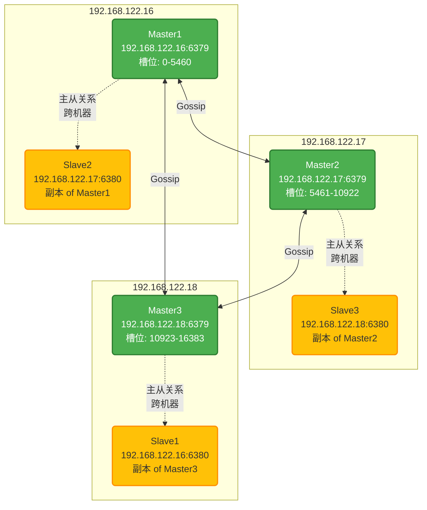
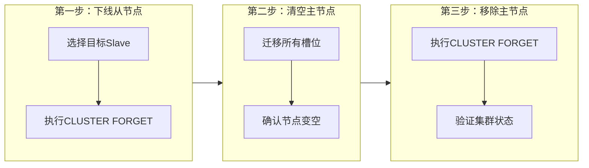

# Redis 高可用集群完整部署指南

> 基于 Redis 7.2.9，涵盖单机部署、多实例、主从复制、哨兵模式的完整实践

## 1. 环境准备

### 1.1 基础环境配置

```shell
# 关闭防火墙和 SELinux
sudo setenforce 0 && sed -i "s@SELINUX=enforcing@SELINUX=disabled@g" /etc/selinux/config
sudo systemctl stop firewalld && sudo systemctl disable firewalld
# 安装编译依赖
sudo dnf install epel-release -y
sudo dnf groupinstall "Development Tools" -y
sudo dnf install -y gcc make jemalloc-devel systemd-devel openssl-devel wget
# 内核参数优化
echo 'vm.overcommit_memory = 1' | sudo tee -a /etc/sysctl.conf
sudo sysctl -p
# 创建 Redis 用户
sudo useradd -r -s /sbin/nologin redis
```
### 1.2 编译安装 Redis

```shell
# 下载并编译
wget https://download.redis.io/releases/redis-7.2.9.tar.gz
tar -xf redis-7.2.9.tar.gz
cd redis-7.2.9
# 编译（启用 systemd 和 TLS 支持）
make USE_SYSTEMD=yes BUILD_TLS=yes MALLOC=jemalloc -j$(nproc)
make install PREFIX=/usr/local/redis
```
## 单机部署

### 2.1 目录结构

```shell
# 创建目录
mkdir -pv /usr/local/redis/{etc,logs,data}
# 复制配置文件
cp redis.conf /usr/local/redis/etc/
# 设置权限
chown -R redis:redis /usr/local/redis
```
### 2.2  配置文件

```
vim /usr/local/redis/etc/redis.conf
# 网络配置
bind 0.0.0.0
port 6379
tcp-backlog 2048
# 守护进程模式（配合 systemd 使用）
daemonize yes
supervised systemd
# 持久化
dbfilename dump.rdb
dir /usr/local/redis/data
# 日志
logfile "/usr/local/redis/logs/redis.log"
# 安全
requirepass MyPassw0rd
# 内存管理
maxmemory 512mb
maxmemory-policy allkeys-lru
```
### 2.3 Systemd 服务

```shell
cat > /etc/systemd/system/redis.service << EOF
[Unit]
Description=Redis In-Memory Data Store
After=network.target

[Service]
Type=notify
User=redis
Group=redis
ExecStart=/usr/local/redis/bin/redis-server /usr/local/redis/etc/redis.conf
ExecStop=/usr/local/redis/bin/redis-cli shutdown
Restart=always
RestartSec=3
LimitNOFILE=65535
ReadWritePaths=/usr/local/redis/data /usr/local/redis/logs

[Install]
WantedBy=multi-user.target
EOF
```
### 2.4 启动验证

```
sudo systemctl daemon-reload
sudo systemctl start redis
sudo systemctl enable redis

# 测试连接
/usr/local/redis/bin/redis-cli -h 192.168.122.16 -p 6379 -a MyPassw0rd ping
# 预期输出: PONG
```
## 3. 多实例部署

### 3.1 实例目录结构

```shell
~]# tree /usr/local/redis/
/usr/local/redis/
├── bin
│   ├── redis-benchmark
│   ├── redis-check-aof -> redis-server
│   ├── redis-check-rdb -> redis-server
│   ├── redis-cli
│   ├── redis-sentinel -> redis-server
│   └── redis-server
├── data
│   └── dump.rdb
├── etc
│   └── redis.conf
└── logs
    └── redis.log
```

### 3.2 创建6379实例

```shell
# 复制基础文件
mkdir -p /data/apps
cp -r /usr/local/redis /data/apps/redis_6379
# 清理初始数据
rm -rf /data/apps/redis_6379/{data,logs}/*
# 修改配置
sed -i "s@dbfilename dump.rdb@dbfilename dump_6379.rdb@g" /data/apps/redis_6379/etc/redis.conf
sed -i 's@logfile "/usr/local/redis/logs/redis.log"@logfile "/data/apps/redis_6379/logs/redis.log"@g' /data/apps/redis_6379/etc/redis.conf
sed -i 's@dir /usr/local/redis/data@dir /data/apps/redis_6379/data@g' /data/apps/redis_6379/etc/redis.conf
# 修改权限
chown -R redis:redis /data/apps/redis_6379
# 准备Systemd服务文件
cat > /etc/systemd/system/redis6379.service << EOF
[Unit]
Description=Redis In-Memory Data Store (6379)
After=network.target

[Service]
Type=notify
User=redis
Group=redis
ExecStart=/data/apps/redis_6379/bin/redis-server /data/apps/redis_6379/etc/redis.conf
ExecStop=/data/apps/redis_6379/bin/redis-cli shutdown
Restart=always
RestartSec=3
LimitNOFILE=65535

[Install]
WantedBy=multi-user.target
EOF
systemctl daemon-reload
```

### 3.3 创建6380实例

```shell
cp -r /usr/local/redis /data/apps/redis_6380
rm -rf /data/apps/redis_6380/{data,logs}/*
# 修改端口和数据文件名
sed -i 's@port 6379@port 6380@g' /data/apps/redis_6380/etc/redis.conf
sed -i "s@dbfilename dump.rdb@dbfilename dump_6380.rdb@g" /data/apps/redis_6380/etc/redis.conf
sed -i 's@logfile "/usr/local/redis/logs/redis.log"@logfile "/data/apps/redis_6380/logs/redis.log"@g' /data/apps/redis_6380/etc/redis.conf
sed -i 's@dir /usr/local/redis/data@dir /data/apps/redis_6380/data@g' /data/apps/redis_6380/etc/redis.conf
chown -R redis:redis /data/apps/redis_6380
# 准备Systemd服务文件
sudo cat > /etc/systemd/system/redis6380.service << EOF
[Unit]
Description=Redis In-Memory Data Store
After=network.target
[Service]
Type=notify
User=redis
Group=redis
ExecStart=/data/apps/redis_6380/bin/redis-server /data/apps/redis_6380/etc/redis.conf
ExecStop=/data/apps/redis_6380/bin/redis-cli shutdown
Restart=always
RestartSec=3
LimitNOFILE=65535
ReadWritePaths=/data/apps/redis_6380/data /data/apps/redis_6380/logs

[Install]
WantedBy=multi-user.target
EOF
sudo systemctl  daemon-reload
```

3.4 启动验证

```
systemctl  start redis6379 redis6380
ss -tnlp|grep redis
LISTEN 0      2048         0.0.0.0:6380      0.0.0.0:*    users:(("redis-server",pid=28918,fd=6))
LISTEN 0      2048         0.0.0.0:6379      0.0.0.0:*    users:(("redis-server",pid=28911,fd=6))
```

## 4. 主从复制

### 4.1 架构说明

| 节点                  | 角色     |
|---------------------|--------|
| 192.168.122.16:6379 | Master |
|192.168.122.16:6380| Slave|

### 4.2 配置方式

**方式一：命令配置（临时生效）**

```
/data/apps/redis_6380/bin/redis-cli -h 192.168.122.16 -p 6380 -a MyPassw0rd
# Redis 7.x 使用 REPLICAOF
192.168.122.16:6380> REPLICAOF 192.168.122.16 6379
OK
192.168.122.16:6380> CONFIG SET masterauth MyPassw0rd
OK
```
**方式二：配置文件（永久生效）**

在从节点 /data/apps/redis_6380/etc/redis.conf 中添加：

```
# 从节点配置文件如下
replicaof 192.168.122.16 6379
masterauth MyPassw0rd
```
### 验证主从状态

```
/data/apps/redis_6379/bin/redis-cli -h 192.168.122.16 -p 6379 -a MyPassw0rd
192.168.122.16:6379> info replication
# Replication
role:master
connected_slaves:1
slave0:ip=192.168.122.16,port=6380,state=online,offset=280,lag=0
master_failover_state:no-failover
master_replid:3508593a4cfb2b170e252e7ea34ed3a43eba34f7
master_replid2:0000000000000000000000000000000000000000
master_repl_offset:280
second_repl_offset:-1
repl_backlog_active:1
repl_backlog_size:1048576
repl_backlog_first_byte_offset:1
repl_backlog_histlen:280
```
### 4.4 断开主从

```
/data/apps/redis_6380/bin/redis-cli -h 192.168.122.16 -p 6380 -a MyPassw0rd
192.168.122.16:6380> REPLICAOF NO ONE
```

## 5. 哨兵模式（Sentinel）

哨兵服务监控redis集群中master节点的状态，当Master节点发生故障时，sentinel节点通过流言(gossip)协议进行投票决定是否执行故障转移，选择合适的slave提升为Master节点对外提供服务，同时将其他节点的master修改为当前新的Master节点，实现集群的高可用。

### 5.1 架构说明

| 节点                  | 角色               |
|---------------------|------------------|
| 192.168.122.16:6379 | master, sentinel |
| 192.168.122.17:6379 | slave, sentinel  |
| 192.168.122.18:6379 | slave, sentinel  |

### 5.2 搭建主从复制环境

确认三台节点已经配置主从关系，需配置文件持久化主从配置

```shell
/data/apps/redis_6379/bin/redis-cli -h 192.168.122.16 -p 6379 -a MyPassw0rd info replication
Warning: Using a password with '-a' or '-u' option on the command line interface may not be safe.
# Replication
role:master
connected_slaves:2
slave0:ip=192.168.122.17,port=6379,state=online,offset=3062,lag=1
slave1:ip=192.168.122.18,port=6379,state=online,offset=3062,lag=1
master_failover_state:no-failover
master_replid:3508593a4cfb2b170e252e7ea34ed3a43eba34f7
master_replid2:0000000000000000000000000000000000000000
master_repl_offset:3062
second_repl_offset:-1
repl_backlog_active:1
repl_backlog_size:1048576
repl_backlog_first_byte_offset:1
repl_backlog_histlen:3062
```

### 5.3 Sentinel 配置文件

```
# 配置Sentinel
cp sentinel.conf /data/apps/redis_6379/etc/
redis-7.2.9]# grep -v "#" /data/apps/redis_6379/etc/sentinel.conf|grep -v "^$"
# 基础配置
protected-mode no
port 26379
daemonize yes
pidfile /var/run/redis-sentinel.pid
loglevel notice
logfile "/data/apps/redis_6379/logs/redis_6379-sentinel.log"
dir /tmp
# 监控主节点
sentinel monitor mymaster 192.168.122.16 6379 2
sentinel auth-pass mymaster MyPassw0rd
# 故障转移配置
sentinel down-after-milliseconds mymaster 30000
sentinel failover-timeout mymaster 180000
sentinel parallel-syncs mymaster 1
# 安全配置
sentinel deny-scripts-reconfig yes
# ACL 配置
acllog-max-len 128
# 主机名解析
SENTINEL resolve-hostnames no
SENTINEL announce-hostnames no
SENTINEL master-reboot-down-after-period mymaster 0
```

### 5.4 Systemd 服务文件

```
cat > /etc/systemd/system/redis-sentinel.service << EOF
[Unit]
Description=Redis Sentinel
After=network.target

[Service]
Type=forking
User=redis
Group=redis
ExecStart=/data/apps/redis_6379/bin/redis-sentinel /data/apps/redis_6379/etc/sentinel.conf
ExecStop=/data/apps/redis_6379/bin/redis-cli -p 26379 shutdown
Restart=always
LimitNOFILE=65535

[Install]
WantedBy=multi-user.target
EOF
systemctl daemon-reload
```

### 5.5 部署到所有节点

```
# 分发配置文件
scp /data/apps/redis_6379/etc/sentinel.conf root@192.168.122.17:/data/apps/redis_6379/etc/
scp /data/apps/redis_6379/etc/sentinel.conf root@192.168.122.18:/data/apps/redis_6379/etc/

# 修正权限
chown -R redis:redis /data/apps/redis_6379/

# 启动哨兵
systemctl daemon-reload
systemctl start redis-sentinel
systemctl enable redis-sentinel
```

### 5.6 验证哨兵状态

```shell
# 查看端口
ss -tnlp | grep 26379
LISTEN 0      511          0.0.0.0:26379      0.0.0.0:*    users:(("redis-sentinel",pid=27932,fd=6))
LISTEN 0      511             [::]:26379         [::]:*    users:(("redis-sentinel",pid=27932,fd=7))
# 查看哨兵信息
 /data/apps/redis_6379/bin/redis-cli -h 192.168.122.16 -p 26379
192.168.122.16:26379> info sentinel
# Sentinel
sentinel_masters:1
sentinel_tilt:0
sentinel_tilt_since_seconds:-1
sentinel_running_scripts:0
sentinel_scripts_queue_length:0
sentinel_simulate_failure_flags:0
master0:name=mymaster,status=ok,address=192.168.122.17:6379,slaves=2,sentinels=3
# 获取当前主节点
192.168.122.16:26379> SENTINEL get-master-addr-by-name mymaster
1) "192.168.122.17"
2) "6379"
# 强制执行故障转移（无需等待其他哨兵同意）
192.168.122.16:26379> SENTINEL FAILOVER mymaster
OK
# 获取当前主节点的 IP 和端口（客户端最常用）
192.168.122.16:26379> SENTINEL get-master-addr-by-name mymaster
1) "192.168.122.16"
2) "6379"
# 查看所有被监控的主节点
192.168.122.16:26379> SENTINEL masters
# 查看特定主节点的详细信息
192.168.122.16:26379> SENTINEL master mymaster
# 查看指定主节点的所有从节点
192.168.122.16:26379> SENTINEL slaves mymaster
# 查看监控同一主节点的其他哨兵
192.168.122.16:26379> SENTINEL sentinels mymaster
# 检查当前哨兵配置是否能达到仲裁要求
192.168.122.16:26379> SENTINEL ckquorum mymaster
OK 3 usable Sentinels. Quorum and failover authorization can be reached
```
### 5.7 Sentinel 常用命令

|命令|	用途
|---|---|
|SENTINEL masters	|查看所有监控的主节点
|SENTINEL master <name>|	查看指定主节点详情
|SENTINEL slaves <name>	|查看从节点列表
|SENTINEL sentinels <name>	|查看其他哨兵节点
|SENTINEL get-master-addr-by-name <name>|	获取当前主节点地址
|SENTINEL failover <name>	|强制故障转移
|SENTINEL ckquorum <name>	|检查仲裁配置
|SENTINEL reset <pattern>	|重置主节点状态

### 5.8 故障转移测试

```
/data/apps/redis_6379/bin/redis-cli -p 26379
127.0.0.1:26379> SENTINEL get-master-addr-by-name mymaster
1) "192.168.122.16"
2) "6379"
# 模拟主节点故障
~]# systemctl  stop redis6379
# 观察哨兵日志
tail -f /data/apps/redis_6379/logs/redis_6379-sentinel.log
# 故障转移完成后，查看新主节点
redis-cli -p 26379 SENTINEL get-master-addr-by-name mymaster
```
- **完整的故障转移日志流程**


|步骤|	事件|	产生日志的哨兵|	日志内容
|---|---|---|---|
1|	检测到主节点无响应|	所有哨兵|	+sdown master mymaster
2	|达到 quorum，判定客观下线	|仅领导者|	+odown master mymaster
3	|开始故障转移|	仅领导者|	+try-failover master mymaster
4	|选举领导者|	所有哨兵|	+vote-for-leader
5	|从节点升级为主节点|	仅领导者|	+selected-slave
6|	故障转移完成|	所有哨兵|	+switch-master
7	|配置更新|	追随者	|+config-update-from


## 6. Redis Cluster

Sentinel 解决了高可用问题，但无法解决单机吞吐量问题。Redis Cluster 提供分布式解决方案：

- 至少需要 3 个 Master 节点
- 数据自动分片（16384 个槽位）
- 支持在线水平扩展
- 部分节点故障不影响整体服务


### 6.1 架构说明

| 主机 IP | 端口 | 角色    | 所属主节点                        | 哈希槽范围 | 说明 |
|---------|------|-------|------------------------------|-----------|------|
| 192.168.122.16 | 6379 | Master | -                            | 0 - 5460 | 主节点 |
| 192.168.122.16 | 6380 | Slave | 192.168.122.18:6379          | - | 备份 Master 2 |
| 192.168.122.17 | 6379 | Master | -                            | 5461 - 10922 | 主节点 |
| 192.168.122.17 | 6380 | Slave | 192.168.122.16:6379          | - | 备份 Master 3 |
| 192.168.122.18 | 6379 | Master | -                            | 10923 - 16383 | 主节点 |
| 192.168.122.18 | 6380 | Slave | 192.168.122.17:6379 | - | 备份 Master 1 |




### 6.2 搭建集群

#### 6.2.1 配置文件示例

```
grep -v "#" /data/apps/redis_6379/etc/redis.conf
bind 0.0.0.0
protected-mode yes
port 6379
# port 6380
tcp-backlog 2048
timeout 0
tcp-keepalive 300
daemonize yes
supervised systemd
pidfile "/var/run/redis_6379.pid"
requirepass "MyPassw0rd"
masterauth "MyPassw0rd"
# 启用集群配置
cluster-enabled yes
cluster-config-file nodes-6379.conf
# cluster-config-file nodes-6380.conf
cluster-require-full-coverage no
```
#### 6.2.2 创建集群

```
# 1. 清理已有数据（如需要）
systemctl stop redis6379 redis6380
rm -rf /data/apps/redis_6379/data/*
rm -rf /data/apps/redis_6380/data/*
systemctl start redis6379 redis6380

# 2. 创建集群
/data/apps/redis_6379/bin/redis-cli --cluster create \
  192.168.122.16:6379 \
  192.168.122.17:6379 \
  192.168.122.18:6379 \
  192.168.122.16:6380 \
  192.168.122.17:6380 \
  192.168.122.18:6380 \
  --cluster-replicas 1 \
  -a MyPassw0rd
Warning: Using a password with '-a' or '-u' option on the command line interface may not be safe.
>>> Performing hash slots allocation on 6 nodes...
Master[0] -> Slots 0 - 5460
Master[1] -> Slots 5461 - 10922
Master[2] -> Slots 10923 - 16383
Adding replica 192.168.122.17:6380 to 192.168.122.16:6379
Adding replica 192.168.122.18:6380 to 192.168.122.17:6379
Adding replica 192.168.122.16:6380 to 192.168.122.18:6379
M: d43b7857b3f36c5e91a8c29892911bfecff140d3 192.168.122.16:6379
   slots:[0-5460] (5461 slots) master
M: 6353d5718d7776c0905b6dc4538ebf8c15c71078 192.168.122.17:6379
   slots:[5461-10922] (5462 slots) master
M: 2d39c02951484ec2d6dafb35fd1fa1fd10804767 192.168.122.18:6379
   slots:[10923-16383] (5461 slots) master
S: 4ef27e98aae90c0849ca77c27afd9ede0dd75a39 192.168.122.16:6380
   replicates 2d39c02951484ec2d6dafb35fd1fa1fd10804767
S: b97162941331fd94ddbce306ef741e4a5b265087 192.168.122.17:6380
   replicates d43b7857b3f36c5e91a8c29892911bfecff140d3
S: 745146c50fe8eea4a7f15a8128b261e8db871077 192.168.122.18:6380
   replicates 6353d5718d7776c0905b6dc4538ebf8c15c71078
Can I set the above configuration? (type 'yes' to accept): yes
>>> Nodes configuration updated
>>> Assign a different config epoch to each node
>>> Sending CLUSTER MEET messages to join the cluster
Waiting for the cluster to join
.
>>> Performing Cluster Check (using node 192.168.122.16:6379)
M: d43b7857b3f36c5e91a8c29892911bfecff140d3 192.168.122.16:6379
   slots:[0-5460] (5461 slots) master
   1 additional replica(s)
M: 6353d5718d7776c0905b6dc4538ebf8c15c71078 192.168.122.17:6379
   slots:[5461-10922] (5462 slots) master
   1 additional replica(s)
S: 4ef27e98aae90c0849ca77c27afd9ede0dd75a39 192.168.122.16:6380
   slots: (0 slots) slave
   replicates 2d39c02951484ec2d6dafb35fd1fa1fd10804767
S: 745146c50fe8eea4a7f15a8128b261e8db871077 192.168.122.18:6380
   slots: (0 slots) slave
   replicates 6353d5718d7776c0905b6dc4538ebf8c15c71078
S: b97162941331fd94ddbce306ef741e4a5b265087 192.168.122.17:6380
   slots: (0 slots) slave
   replicates d43b7857b3f36c5e91a8c29892911bfecff140d3
M: 2d39c02951484ec2d6dafb35fd1fa1fd10804767 192.168.122.18:6379
   slots:[10923-16383] (5461 slots) master
   1 additional replica(s)
[OK] All nodes agree about slots configuration.
>>> Check for open slots...
>>> Check slots coverage...
[OK] All 16384 slots covered.
```

#### 6.2.3 验证集群

```
# 查看集群节点信息
~]# /data/apps/redis_6379/bin/redis-cli -h 192.168.122.18 -p 6379 -a MyPassw0rd  cluster nodes
Warning: Using a password with '-a' or '-u' option on the command line interface may not be safe.
4ef27e98aae90c0849ca77c27afd9ede0dd75a39 192.168.122.16:6380@16380 slave 2d39c02951484ec2d6dafb35fd1fa1fd10804767 0 1776590555842 3 connected
745146c50fe8eea4a7f15a8128b261e8db871077 192.168.122.18:6380@16380 slave 6353d5718d7776c0905b6dc4538ebf8c15c71078 0 1776590559864 2 connected
2d39c02951484ec2d6dafb35fd1fa1fd10804767 192.168.122.18:6379@16379 myself,master - 0 1776590558000 3 connected 10923-16383
6353d5718d7776c0905b6dc4538ebf8c15c71078 192.168.122.17:6379@16379 master - 0 1776590557852 2 connected 5461-10922
b97162941331fd94ddbce306ef741e4a5b265087 192.168.122.17:6380@16380 slave d43b7857b3f36c5e91a8c29892911bfecff140d3 0 1776590557000 1 connected
d43b7857b3f36c5e91a8c29892911bfecff140d3 192.168.122.16:6379@16379 master - 0 1776590558859 1 connected 0-5460
# 查看集群状态
~]# /data/apps/redis_6379/bin/redis-cli -h 192.168.122.18 -p 6379 -a MyPassw0rd  cluster info
Warning: Using a password with '-a' or '-u' option on the command line interface may not be safe.
cluster_state:ok
cluster_slots_assigned:16384
cluster_slots_ok:16384
cluster_slots_pfail:0
cluster_slots_fail:0
cluster_known_nodes:6
cluster_size:3
cluster_current_epoch:6
cluster_my_epoch:3
cluster_stats_messages_ping_sent:1461
cluster_stats_messages_pong_sent:1402
cluster_stats_messages_meet_sent:1
cluster_stats_messages_sent:2864
cluster_stats_messages_ping_received:1402
cluster_stats_messages_pong_received:1462
cluster_stats_messages_received:2864
total_cluster_links_buffer_limit_exceeded:0
# 检查集群完整性
~]# /data/apps/redis_6379/bin/redis-cli -h 192.168.122.18 -p 6379 -a MyPassw0rd --cluster check 192.168.122.18:6379
Warning: Using a password with '-a' or '-u' option on the command line interface may not be safe.
192.168.122.18:6379 (2d39c029...) -> 0 keys | 5461 slots | 1 slaves.
192.168.122.17:6379 (6353d571...) -> 0 keys | 5462 slots | 1 slaves.
192.168.122.16:6379 (d43b7857...) -> 0 keys | 5461 slots | 1 slaves.
[OK] 0 keys in 3 masters.
0.00 keys per slot on average.
>>> Performing Cluster Check (using node 192.168.122.18:6379)
M: 2d39c02951484ec2d6dafb35fd1fa1fd10804767 192.168.122.18:6379
   slots:[10923-16383] (5461 slots) master
   1 additional replica(s)
S: 4ef27e98aae90c0849ca77c27afd9ede0dd75a39 192.168.122.16:6380
   slots: (0 slots) slave
   replicates 2d39c02951484ec2d6dafb35fd1fa1fd10804767
S: 745146c50fe8eea4a7f15a8128b261e8db871077 192.168.122.18:6380
   slots: (0 slots) slave
   replicates 6353d5718d7776c0905b6dc4538ebf8c15c71078
M: 6353d5718d7776c0905b6dc4538ebf8c15c71078 192.168.122.17:6379
   slots:[5461-10922] (5462 slots) master
   1 additional replica(s)
S: b97162941331fd94ddbce306ef741e4a5b265087 192.168.122.17:6380
   slots: (0 slots) slave
   replicates d43b7857b3f36c5e91a8c29892911bfecff140d3
M: d43b7857b3f36c5e91a8c29892911bfecff140d3 192.168.122.16:6379
   slots:[0-5460] (5461 slots) master
   1 additional replica(s)
[OK] All nodes agree about slots configuration.
>>> Check for open slots...
>>> Check slots coverage...
[OK] All 16384 slots covered.
```

### 6.3 集群扩容(增加1主1从)

集群扩容的核心流程分为三步：准备新节点 → 加入集群 → 迁移槽位。整个过程可以在线完成，无需停机


#### 6.3.1 准备新节点

| 实例| 角色|
| --- | --- |
|192.168.122.16:6381| Master
|192.168.122.17:6381 |Slave

```
# 1. 复制配置目录，并清理数据已经存在的数据
cp -r /data/apps/redis_6379 /data/apps/redis_6381
rm -rf /data/apps/redis_6381/{data,logs}/*
# 2. 修改配置文件
vim /data/apps/redis_6381/etc/redis.conf
port 6381
pidfile "/var/run/redis_6381.pid"
logfile "/data/apps/redis_6381/logs/redis.log"
appendonly yes
requirepass MyPassw0rd
masterauth MyPassw0rd
dbfilename "dump_6381.rdb"
dir "/data/apps/redis_6381/data"
# 启用集群配置
cluster-enabled yes
cluster-config-file nodes-6381.conf
cluster-require-full-coverage no
# 3. 创建 systemd 服务文件
cat > /etc/systemd/system/redis6381.service << EOF
[Unit]
Description=Redis In-Memory Data Store
After=network.target

[Service]
Type=notify
User=redis
Group=redis
ExecStart=/data/apps/redis_6381/bin/redis-server /data/apps/redis_6381/etc/redis.conf
ExecStop=/data/apps/redis_6381/bin/redis-cli shutdown
Restart=always
RestartSec=3
LimitNOFILE=65535
ReadWritePaths=/data/apps/redis_6381/data /data/apps/redis_6381/logs

[Install]
WantedBy=multi-user.target
EOF

# 4. 启动服务
chown -R redis:redis /data/apps/redis_6381
systemctl daemon-reload
systemctl start redis6381

# 5. 验证启动
redis-cli -h 192.168.122.16 -p 6381 -a MyPassw0rd ping
redis-cli -h 192.168.122.17 -p 6381 -a MyPassw0rd ping
```

#### 6.3.2 加入集群

```shell
# 添加 Master 节点
~]# /data/apps/redis_6379/bin/redis-cli -a MyPassw0rd \
  --cluster add-node 192.168.122.16:6381 192.168.122.16:6379
Warning: Using a password with '-a' or '-u' option on the command line interface may not be safe.
>>> Adding node 192.168.122.16:6381 to cluster 192.168.122.16:6379
Could not connect to Redis at 192.168.122.17:6380: Connection refused
>>> Performing Cluster Check (using node 192.168.122.16:6379)
M: d43b7857b3f36c5e91a8c29892911bfecff140d3 192.168.122.16:6379
   slots:[0-5460] (5461 slots) master
S: 745146c50fe8eea4a7f15a8128b261e8db871077 192.168.122.18:6380
   slots: (0 slots) slave
   replicates 6353d5718d7776c0905b6dc4538ebf8c15c71078
S: 4ef27e98aae90c0849ca77c27afd9ede0dd75a39 192.168.122.16:6380
   slots: (0 slots) slave
   replicates 2d39c02951484ec2d6dafb35fd1fa1fd10804767
M: 6353d5718d7776c0905b6dc4538ebf8c15c71078 192.168.122.17:6379
   slots:[5461-10922] (5462 slots) master
   1 additional replica(s)
M: 2d39c02951484ec2d6dafb35fd1fa1fd10804767 192.168.122.18:6379
   slots:[10923-16383] (5461 slots) master
   1 additional replica(s)
[OK] All nodes agree about slots configuration.
>>> Check for open slots...
>>> Check slots coverage...
[OK] All 16384 slots covered.
>>> Getting functions from cluster
>>> Send FUNCTION LIST to 192.168.122.16:6381 to verify there is no functions in it
>>> Send FUNCTION RESTORE to 192.168.122.16:6381
>>> Send CLUSTER MEET to node 192.168.122.16:6381 to make it join the cluster.
[OK] New node added correctly.

# 添加 Slave 节点（指定主节点）
~]# /data/apps/redis_6379/bin/redis-cli -a MyPassw0rd \
  --cluster add-node 192.168.122.17:6381 192.168.122.16:6381 --cluster-slave
Warning: Using a password with '-a' or '-u' option on the command line interface may not be safe.
>>> Adding node 192.168.122.17:6381 to cluster 192.168.122.16:6381
Could not connect to Redis at 192.168.122.17:6380: Connection refused
>>> Performing Cluster Check (using node 192.168.122.16:6381)
M: d450159d51f0b3e1fea396644eb6eae3fab2c707 192.168.122.16:6381
   slots: (0 slots) master
M: 6353d5718d7776c0905b6dc4538ebf8c15c71078 192.168.122.17:6379
   slots:[5461-10922] (5462 slots) master
   1 additional replica(s)
M: d43b7857b3f36c5e91a8c29892911bfecff140d3 192.168.122.16:6379
   slots:[0-5460] (5461 slots) master
M: 2d39c02951484ec2d6dafb35fd1fa1fd10804767 192.168.122.18:6379
   slots:[10923-16383] (5461 slots) master
   1 additional replica(s)
S: 745146c50fe8eea4a7f15a8128b261e8db871077 192.168.122.18:6380
   slots: (0 slots) slave
   replicates 6353d5718d7776c0905b6dc4538ebf8c15c71078
S: 4ef27e98aae90c0849ca77c27afd9ede0dd75a39 192.168.122.16:6380
   slots: (0 slots) slave
   replicates 2d39c02951484ec2d6dafb35fd1fa1fd10804767
[OK] All nodes agree about slots configuration.
>>> Check for open slots...
>>> Check slots coverage...
[OK] All 16384 slots covered.
Automatically selected master 192.168.122.16:6381
>>> Send CLUSTER MEET to node 192.168.122.17:6381 to make it join the cluster.
Waiting for the cluster to join

>>> Configure node as replica of 192.168.122.16:6381.
[OK] New node added correctly.
```
#### 6.3.3 迁移槽位

```
~]# /data/apps/redis_6379/bin/redis-cli -h 192.168.122.18 -p 6379 -a MyPassw0rd  --cluster info  192.168.122.16:6381
Warning: Using a password with '-a' or '-u' option on the command line interface may not be safe.
Could not connect to Redis at 192.168.122.17:6380: Connection refused
192.168.122.16:6381 (d450159d...) -> 0 keys | 0 slots | 1 slaves.
192.168.122.17:6379 (6353d571...) -> 0 keys | 5462 slots | 1 slaves.
192.168.122.16:6379 (d43b7857...) -> 32 keys | 5461 slots | 0 slaves.
192.168.122.18:6379 (2d39c029...) -> 0 keys | 5461 slots | 1 slaves.
[OK] 32 keys in 4 masters.
0.00 keys per slot on average.
# 获取新 Master 的 Node ID
~]# /data/apps/redis_6379/bin/redis-cli -h 192.168.122.16 -p 6381 -a MyPassw0rd   cluster nodes | grep myself
Warning: Using a password with '-a' or '-u' option on the command line interface may not be safe.
d450159d51f0b3e1fea396644eb6eae3fab2c707 192.168.122.16:6381@16381 myself,master - 0 1776593361000 0 connected
# 迁移 4096 个槽位（从所有现有 Master 平均分配）16384/4=4096
/data/apps/redis_6379/bin/redis-cli -a MyPassw0rd \
  --cluster reshard 192.168.122.16:6379 \
  --cluster-to d450159d51f0b3e1fea396644eb6eae3fab2c707 \
  --cluster-slots 4096 \
  --cluster-from all \
  --cluster-yes
# 验证扩容结果
~]# /data/apps/redis_6379/bin/redis-cli -h 192.168.122.18 -p 6379 -a MyPassw0rd  --cluster info  192.168.122.16:6381
Warning: Using a password with '-a' or '-u' option on the command line interface may not be safe.
192.168.122.16:6381 (d450159d...) -> 7 keys | 4096 slots | 1 slaves.
192.168.122.17:6379 (6353d571...) -> 0 keys | 4096 slots | 1 slaves.
192.168.122.16:6379 (d43b7857...) -> 25 keys | 4096 slots | 1 slaves.
192.168.122.18:6379 (2d39c029...) -> 0 keys | 4096 slots | 1 slaves.
[OK] 32 keys in 4 masters.
0.00 keys per slot on average.
```
#### 6.3.4 扩容脚本
```
#!/bin/bash
# 从 3 主 3 从扩容到 4 主 4 从

REDIS_CLI="/data/apps/redis_6379/bin/redis-cli"
PASS="MyPassw0rd"
EXISTING_NODE="192.168.122.16:6379"
NEW_MASTER="192.168.122.16:6381"
NEW_SLAVE="192.168.122.17:6381"

# 添加新 Master
$REDIS_CLI -a $PASS --cluster add-node $NEW_MASTER $EXISTING_NODE

# 获取新 Master ID
MASTER_ID=$($REDIS_CLI -h ${NEW_MASTER%:*} -p ${NEW_MASTER#*:} -a $PASS \
  cluster nodes | grep myself | awk '{print $1}')

# 添加新 Slave
$REDIS_CLI -a $PASS --cluster add-node $NEW_SLAVE $NEW_MASTER --cluster-slave

# 迁移槽位
$REDIS_CLI -a $PASS --cluster reshard $EXISTING_NODE \
  --cluster-to $MASTER_ID \
  --cluster-slots 4096 \
  --cluster-from all \
  --cluster-yes

# 验证
$REDIS_CLI -a $PASS --cluster check $EXISTING_NODE
echo "扩容完成！"
```

### 6.5 集群缩容

集群缩容是扩容的逆操作，核心思路是：把要下线的节点所负责的槽位全部迁移到其他节点上，等它变空之后，再通知集群把它“遗忘”掉。



> 下线 192.168.122.16:6381 这个主节点及其对应的从节点 192.168.122.17:6381。

#### 6.4.1 下线从节点

从节点不负责数据，所以可以先处理它，让集群先把它“遗忘

```shell
# 1. 获取待下线从节点的 Node ID
~]# /data/apps/redis_6379/bin/redis-cli -h 192.168.122.16 -p 6379 -a MyPassw0rd \
  cluster nodes | grep 192.168.122.17:6381
Warning: Using a password with '-a' or '-u' option on the command line interface may not be safe.
98c647847d699b112b60243822140bde38070014 192.168.122.17:6381@16381 slave d450159d51f0b3e1fea396644eb6eae3fab2c707 0 1776598719000 10 connected

# 2. 在所有保留节点上执行 FORGET
for port in 6379 6380; do
  for ip in 16 17 18; do
    echo "Forgetting node on 192.168.122.$ip:$port"
    /data/apps/redis_6379/bin/redis-cli -h 192.168.122.$ip -p $port -a MyPassw0rd \
      CLUSTER FORGET 98c647847d699b112b60243822140bde38070014
  done
done
/data/apps/redis_6379/bin/redis-cli -h 192.168.122.16 -p 6381 -a MyPassw0rd \
      CLUSTER FORGET 98c647847d699b112b60243822140bde38070014
```
#### 6.4.2 迁移主节点槽位

主节点是核心，需要先把它的“家产”（数据和槽位）分给别人，它才能安心退休。

```
# 1. 获取待主节点的 Node ID
~]# /data/apps/redis_6379/bin/redis-cli -h 192.168.122.16 -p 6379 -a MyPassw0rd   cluster nodes | grep master
Warning: Using a password with '-a' or '-u' option on the command line interface may not be safe.
d43b7857b3f36c5e91a8c29892911bfecff140d3 192.168.122.16:6379@16379 myself,master - 0 1776599106000 8 connected 1365-5460
d450159d51f0b3e1fea396644eb6eae3fab2c707 192.168.122.16:6381@16381 master - 0 1776599104000 10 connected 0-1364 5461-6826 10923-12287
6353d5718d7776c0905b6dc4538ebf8c15c71078 192.168.122.17:6379@16379 master - 0 1776599106293 2 connected 6827-10922
2d39c02951484ec2d6dafb35fd1fa1fd10804767 192.168.122.18:6379@16379 master - 0 1776599104286 3 connected 12288-16383
# 2. 把192.168.122.16:6381 实例上的所有槽位迁移到其他三个主节点上
## 1. 确定接收者: 为了让数据分布更均衡，最好的做法是把槽位平均迁给其他三个Master。
#  2. 计算迁移量: 假如 Master-4 上有4096个槽位，我们可以让其中2个接收约1365个slot,剩下的1366分配给第三个节点，从而保证slot都被迁移。
## 迁移给192.168.122.16:6379
/data/apps/redis_6379/bin/redis-cli -a MyPassw0rd \
  --cluster reshard 192.168.122.16:6379 \
  --cluster-from d450159d51f0b3e1fea396644eb6eae3fab2c707 \
  --cluster-to d43b7857b3f36c5e91a8c29892911bfecff140d3 \
  --cluster-slots 1365 \
  --cluster-yes
## 迁移给 192.168.122.17:6379
/data/apps/redis_6379/bin/redis-cli -a MyPassw0rd \
  --cluster reshard 192.168.122.16:6379 \
  --cluster-from d450159d51f0b3e1fea396644eb6eae3fab2c707 \
  --cluster-to 6353d5718d7776c0905b6dc4538ebf8c15c71078 \
  --cluster-slots 1365 \
  --cluster-yes
## 迁移给 192.168.122.18:6379
/data/apps/redis_6379/bin/redis-cli -a MyPassw0rd \
  --cluster reshard 192.168.122.16:6379 \
  --cluster-from d450159d51f0b3e1fea396644eb6eae3fab2c707 \
  --cluster-to 2d39c02951484ec2d6dafb35fd1fa1fd10804767 \
  --cluster-slots 1366 \
  --cluster-yes
# 3. 确认槽位已清空（节点角色应变为 slave）
 ~]# /data/apps/redis_6379/bin/redis-cli -h 192.168.122.16 -p 6379 -a MyPassw0rd \
  cluster nodes | grep 192.168.122.16:6381
Warning: Using a password with '-a' or '-u' option on the command line interface may not be safe.
d450159d51f0b3e1fea396644eb6eae3fab2c707 192.168.122.16:6381@16381 slave 2d39c02951484ec2d6dafb35fd1fa1fd10804767 0 1776599786239 13 connected
```

#### 6.4.3 下线主节点并验证
```
# 1. 下线主节点
for port in 6379 6380; do
  for ip in 16 17 18; do
    echo "Forgetting node on 192.168.122.$ip:$port"
    /data/apps/redis_6379/bin/redis-cli -h 192.168.122.$ip -p $port -a MyPassw0rd \
      CLUSTER FORGET d450159d51f0b3e1fea396644eb6eae3fab2c707
  done
done
# 2. 验证集群状态
/data/apps/redis_6379/bin/redis-cli -a MyPassw0rd --cluster check 192.168.122.16:6379

# 3. 确认节点数量（应为 6 个）
~]# /data/apps/redis_6379/bin/redis-cli -h 192.168.122.16 -p 6379 -a MyPassw0rd   cluster nodes | wc -lWarning: Using a password with '-a' or '-u' option on the command line interface may not be safe.
6
# 4. 确认槽位完整覆盖
~]# /data/apps/redis_6379/bin/redis-cli -a MyPassw0rd --cluster check 192.168.122.16:6379 \
  | grep "All 16384 slots covered"
Warning: Using a password with '-a' or '-u' option on the command line interface may not be safe.
[OK] All 16384 slots covered.
```
