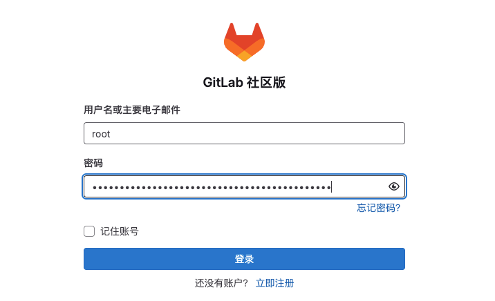
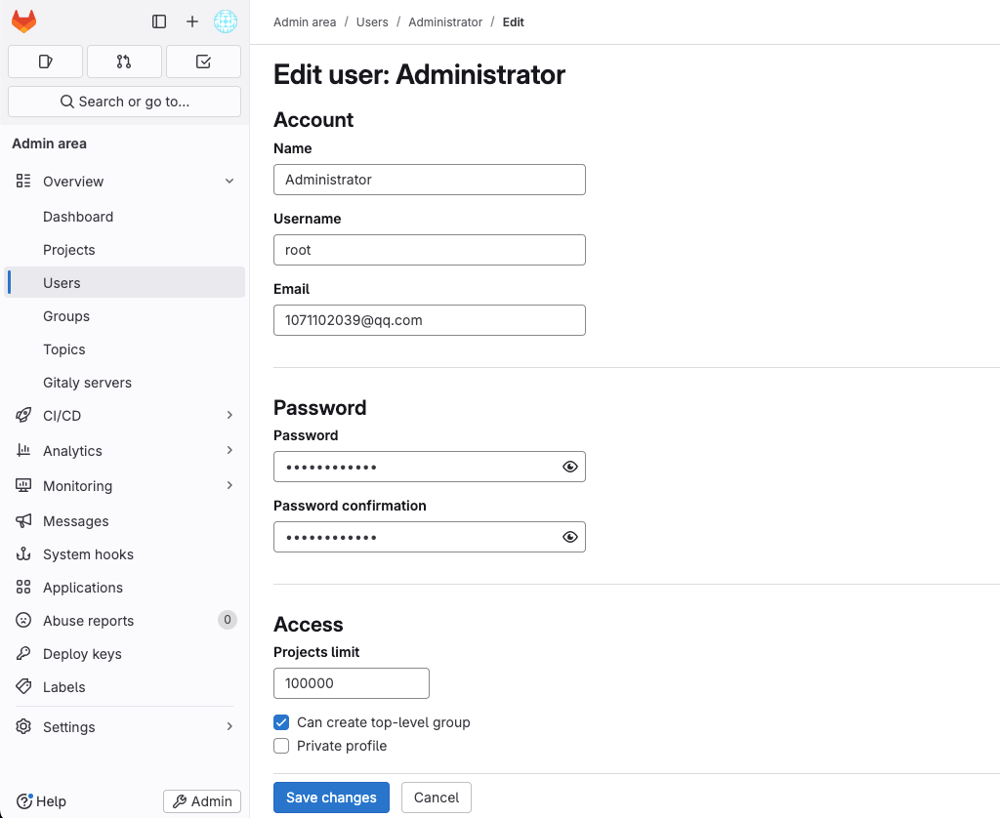

# GitLab代码管理

## GitLab安装
使用[清华源](https://mirrors.tuna.tsinghua.edu.cn/help/gitlab-ce/)安装gitlab

### 1. 安装gitlab
```shell
curl -fsSL https://packages.gitlab.com/gpg.key | gpg --dearmor -o /usr/share/keyrings/gitlab_gitlab-ce-archive-keyring.gpg
cat > /etc/apt/sources.list.d/gitlab-ce.list << 'EOF'
deb [signed-by=/usr/share/keyrings/gitlab_gitlab-ce-archive-keyring.gpg] https://mirrors4.tuna.tsinghua.edu.cn/gitlab-ce/ubuntu noble main
EOF
apt update
apt install gitlab-ce=17.11.7-ce.0
```
### 2.配置gitlab.rb
```shell
vim /etc/gitlab/gitlab.rb
external_url 'http://192.168.1.132'
```

### 3.启动gitlab

```shell
~# gitlab-ctl reconfigure
```

### 4.获取初始密码

```shell
~# cat /etc/gitlab/initial_root_password
```


### 5.修改管理密码



