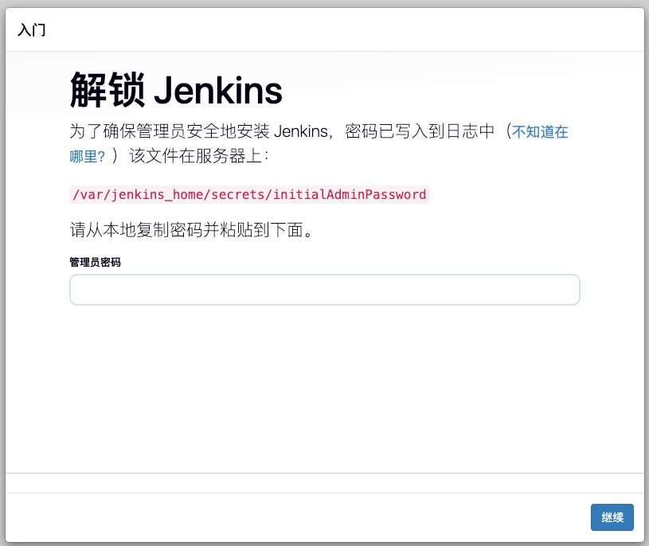

# Jenkins 持续集成

## Jenkins安装

### 1. 准备数据目录

```shell
mkdir -pv   /apps/jenkins && cd /apps/jenkins \
  && mkdir jenkins_home && chown 1000:1000 jenkins_home
```

### 2. 创建docker-compose.yml

```shell
cat > docker-compose.yml <<'EOF'
version: '3.8'
services:
  jenkins:
    image: jenkins/jenkins:lts
    container_name: jenkins
    privileged: true
    ports:
      - "8080:8080"
      - "50000:50000"
    environment:
      - TZ=Asia/Shanghai
    volumes:
      - ./jenkins_home:/var/jenkins_home
      - /etc/localtime:/etc/localtime:ro  # 保证宿主机与容器时区一致
    restart: always
EOF
```

### 3. 启动jenkins

```shell
docker compose up -d && docker logs -f jenkins
```

### 4.访问Jenkins

- 解锁Jenkins



- 安装推荐插件


- 创建管理用户


- 实例配置


## 添加Agent节点
### 1.从节点安装JDK
```shell
~# wget https://mirrors.tuna.tsinghua.edu.cn/Adoptium/17/jdk/x64/linux/OpenJDK17U-jdk_x64_linux_hotspot_17.0.17_10.tar.gz
~# tar -xf OpenJDK17U-jdk_x64_linux_hotspot_17.0.17_10.tar.gz -C /usr/local
cat >> /etc/profile.d/tools.sh << 'EOF'
JAVA_HOME="/usr/local/jdk-17.0.17+10"
PATH=$JAVA_HOME/bin:$PATH
export JAVA_HOME
export PATH
EOF
. /etc/profile.d/tools.sh
~# java -version
openjdk version "17.0.17" 2025-10-21
OpenJDK Runtime Environment Temurin-17.0.17+10 (build 17.0.17+10)
OpenJDK 64-Bit Server VM Temurin-17.0.17+10 (build 17.0.17+10, mixed mode, sharing)
```
### 2.安装Agent

- 添加Node


- 使用Java Web 方式启动代理


```shell
~# mkdir -pv /data/apps/jenkinsagent01 && cd /data/apps/jenkinsagent01
~# curl -sO http://192.168.1.130:8080/jnlpJars/agent.jar
~# cat > start.sh << "EOF"
#!/bin/bash
#
nohup java -jar agent.jar -url http://192.168.1.130:8080/ -secret 4a0349e2c1cb895933dc49ec5e9dad9c0b1a55ce7ff32e116a5697c4d6beff5c -name build01 -webSocket -workDir "/data/apps/jenkinsagent01" &
EOF
/data/apps/jenkinsagent01# bash start.sh
```
## 构建工具集成

### Maven

#### 1. 在构建节点安装Maven

在构建节点安装构建工具，如果想安装到Jenkins容器，则需要将工具目录挂载到Jenkins容器里面。

```shell
# 安装jdk
~# wget https://mirrors.tuna.tsinghua.edu.cn/Adoptium/17/jdk/x64/linux/OpenJDK17U-jdk_x64_linux_hotspot_17.0.17_10.tar.gz
~# wget https://dlcdn.apache.org/maven/maven-3/3.9.11/binaries/apache-maven-3.9.11-bin.tar.gz
~# tar -xf OpenJDK17U-jdk_x64_linux_hotspot_17.0.17_10.tar.gz -C /usr/local
~# tar -xf apache-maven-3.9.11-bin.tar.gz  -C /usr/local/
~# cat > /etc/profile.d/tools.sh << 'EOF'
JAVA_HOME="/usr/local/jdk-17.0.17+10/"
MAVEN_HOME=/usr/local/apache-maven-3.9.11/
PATH=$MAVEN_HOME/bin:$JAVA_HOME/bin:$PATH
export MAVEN_HOME
export JAVA_HOME
export PATH
EOF
~# . /etc/profile.d/tools.sh
~# mvn -version
Apache Maven 3.9.11 (3e54c93a704957b63ee3494413a2b544fd3d825b)
Maven home: /usr/local/apache-maven-3.9.11
Java version: 17.0.17, vendor: Eclipse Adoptium, runtime: /usr/local/jdk-17.0.17+10
Default locale: en_US, platform encoding: UTF-8
OS name: "linux", version: "6.8.0-85-generic", arch: "amd64", family: "unix"
```
#### 2.配置[阿里云Maven](https://developer.aliyun.com/mirror/maven)

打开 Maven 的配置文件(一般在maven安装目录的conf/settings.xml)，在标签中添加 mirror 子节点:
```shell
~# vim /usr/local/apache-maven-3.9.11/conf/settings.xml
<mirrors>
    <mirror>
       <id>aliyunmaven</id>
       <mirrorOf>*</mirrorOf>
       <name>阿里云公共仓库</name>
       <url>https://maven.aliyun.com/repository/public</url>
   </mirror>
</mirrors>
```

#### 3.测试maven命令

```shell
~# git clone https://gitee.com/dengyouf/springboot-app.git
~# cd springboot-app/
~/springboot-app# mvn package -DskipTests
~/springboot-app# tree -L 1 target/
target/
├── classes
├── generated-sources
├── generated-test-sources
├── helloword-0.0.1-SNAPSHOT.jar
├── helloword-0.0.1-SNAPSHOT.jar.original
├── maven-archiver
├── maven-status
└── test-classes

7 directories, 2 files
```

#### 4.配置Jenkins

在全局工具中配置JDK和Maven

- 配置JDK


- 配置Maven


#### 5.Jenkinsfile集成

```shell
pipeline {
    agent {
        label 'build01'
    }
    tools {
        jdk 'jdk17'
        maven 'maven3'
    }
    stages {
        stage('Checkout') {
            steps {
                checkout scmGit(
                    branches: [[name: '*/main']],
                    extensions: [],
                    userRemoteConfigs: [
                        [
                            credentialsId: 'gitlab-password-for-root',
                            url: 'http://192.168.1.132/devops/springboot-app.git'
                        ]
                    ]
                )
            }
        }
        stage('Build') {
            steps {
                sh"""
                mvn package -DskipTests
                """
            }
        }
    }
}
```

### Npm

Npm是常用的前端打包工具

#### 1.安装nvm

[nvm](https://nvm.uihtm.com/)全英文也叫node.js version management，是一个nodejs的版本管理工具。nvm和n都是node.js版本管理工具，为了解决node.js各种版本存在不兼容现象可以通过它可以安装和切换不同版本的node.js。

```shell
curl -o- https://ghfast.top/https://raw.githubusercontent.com/nvm-sh/nvm/v0.40.3/install.sh | bash
cat > /etc/profile.d/nvm.sh << 'EOF'
export NVM_DIR="$HOME/.nvm"
[ -s "$NVM_DIR/nvm.sh" ] && \. "$NVM_DIR/nvm.sh"  # This loads nvm
[ -s "$NVM_DIR/bash_completion" ] && \. "$NVM_DIR/bash_completion"
EOF
~# . /etc/profile.d/nvm.sh
~# nvm -v
0.40.3
```

#### 2.通过nvm安装node

```shell
~# nvm install v18.20.2
~# nvm use v18.20.2
Now using node v18.20.2 (npm v10.5.0)
~# node -v
v18.20.2
```

#### 3.设置源

```shell
~# npm install -g nrm
~# nrm use ls
  npm ---------- https://registry.npmjs.org/
  yarn --------- https://registry.yarnpkg.com/
  tencent ------ https://mirrors.tencent.com/npm/
  cnpm --------- https://r.cnpmjs.org/
  taobao ------- https://registry.npmmirror.com/
  npmMirror ---- https://skimdb.npmjs.com/registry/
  huawei ------- https://repo.huaweicloud.com/repository/npm/
~# nrm use tencent
```
#### 4.安装pnpm

```shell
~# npm install -g pnpm
```

#### 5.测试打包

```shell
~# git clone https://gitee.com/dengyouf/npm-web-service.git
# 安装依赖
~# pnpm install
# 打包
~# pnpm build
```

#### 6.Jenkinsfile集成

```shell
pipeline {
    agent {
        label 'build01'
    }
    environment {
        NODE_VERSION = 'v18.20.2'
    }
    stages {
        stage('Setup Node.js') {
            steps {
                sh """
                    # 假设 nvm 已经预安装
                    . /etc/profile.d/nvm.sh
                    nvm install ${NODE_VERSION}
                    nvm use ${NODE_VERSION}
                """
            }
        }
        stage('Checkout') {
            steps {
                checkout scmGit(
                    branches: [[name: '*/main']],
                    extensions: [],
                    userRemoteConfigs: [
                        [
                            credentialsId: 'gitlab-password-for-root',
                            url: 'http://192.168.1.132/devops/npm-web-service.git'
                        ]
                    ]
                )
            }
        }
        stage('Build') {
            steps {
                sh """
                    . /etc/profile.d/nvm.sh
                    nvm use ${NODE_VERSION}
                    npm install -g pnpm
                    pnpm install
                    pnpm build
                """
            }
        }
    }
}
```

### Sonar-Scanner

#### 1.安装sonar scanner CLI
```shell
wget https://binaries.sonarsource.com/Distribution/sonar-scanner-cli/sonar-scanner-cli-7.2.0.5079-linux-x64.zip
unzip sonar-scanner-cli-7.2.0.5079-linux-x64.zip  -d /usr/local/
/usr/local/sonar-scanner-7.2.0.5079-linux-x64/bin/sonar-scanner -v
14:27:34.494 INFO  Scanner configuration file: /usr/local/sonar-scanner-7.2.0.5079-linux-x64/conf/sonar-scanner.properties
14:27:34.499 INFO  Project root configuration file: NONE
14:27:34.519 INFO  SonarScanner CLI 7.2.0.5079
14:27:34.522 INFO  Linux 6.8.0-85-generic amd64
```
#### 2.测试命令

```shell
~# cd springboot-app/
~/springboot-app# ls
mvnw  mvnw.cmd  pom.xml  README.md  src  target
~/springboot-app# /usr/local/sonar-scanner-7.2.0.5079-linux-x64/bin/sonar-scanner \
                -Dsonar.login=sqa_ff52ca99b716618d3d1591082a53f0ec0c0ce146 \
                -Dsonar.host.url=http://192.168.1.131:9000 \
                -Dsonar.branch.name=master \
                -Dsonar.projectKey=springboot-app-v1 \
                -Dsonar.java.binaries=target/classes \
                -Dsonar.sources=src \
                -Dsonar.sourceEncoding=UTF-8
```


#### 3.Jenkinsfile集成

Jenkins与Sonarqube集成需要满足下面的条件：

- 1. 安装SonarQube Scanner插件


- 2.添加sonarqube token 到Jenkins的secret认证信息


- 3.系统管理配置Sonarqube Server


- 4.使用Sonar Scanner CLI扫描
```shell
pipeline {
    agent {
        label 'build01'
    }
    tools {
        jdk 'jdk17'
        maven 'maven3'
    }
    environment {
      SONAR_SCANNER_HOME = '/usr/local/sonar-scanner-7.2.0.5079-linux-x64'
      BRANCH_NAME = "${env.BUILD_ID}"
      PROJECT_KEY = "${env.JOB_NAME}"
    }
    stages {
        stage('Checkout') {
            steps {
                checkout scmGit(
                    branches: [[name: '*/main']],
                    extensions: [],
                    userRemoteConfigs: [
                        [
                            credentialsId: 'gitlab-password-for-root',
                            url: 'http://192.168.1.132/devops/springboot-app.git'
                        ]
                    ]
                )
            }
        }
        stage('Build') {
            steps {
                sh"""
                mvn package -DskipTests
                """
            }
        }
        stage("SonarQube Analysis") {
          steps {
              withSonarQubeEnv('SonarQube Server') {
                  sh """
                      ${SONAR_SCANNER_HOME}/bin/sonar-scanner \
                      -Dsonar.login=${SONAR_AUTH_TOKEN} \
                      -Dsonar.host.url=${SONAR_HOST_URL} \
                      -Dsonar.branch.name=${BRANCH_NAME} \
                      -Dsonar.projectKey=${PROJECT_KEY} \
                      -Dsonar.java.binaries=target/classes \
                      -Dsonar.sources=src \
                      -Dsonar.sourceEncoding=UTF-8
                  """
              }
          }
        }
    }
}
```
- 使用 Maven 的内置 Sonar 插件
```shell

pipeline {
    agent {
        label 'build01'
    }
    tools {
        jdk 'jdk17'
        maven 'maven3'
    }
    environment {
      BRANCH_NAME = "${env.BUILD_ID}"
      PROJECT_KEY = "${env.JOB_NAME}"
    }
    stages {
        stage('Checkout') {
            steps {
                checkout scmGit(
                    branches: [[name: '*/main']],
                    extensions: [],
                    userRemoteConfigs: [
                        [
                            credentialsId: 'gitlab-password-for-root',
                            url: 'http://192.168.1.132/devops/springboot-app.git'
                        ]
                    ]
                )
            }
        }
        stage('Build') {
            steps {
                sh"""
                mvn package -DskipTests
                """
            }
        }
        stage("SonarQube Analysis") {
          steps {
              withSonarQubeEnv('SonarQube Server') {
                sh """
                    mvn sonar:sonar \
                    -Dsonar.projectKey=${PROJECT_KEY} \
                    -Dsonar.host.url=${SONAR_HOST_URL} \
                    -Dsonar.token=${SONAR_AUTH_TOKEN} \
                    -Dsonar.branch.name=${BRANCH_NAME}
                """
              }
          }
        }
    }
}
```
- 5.扫描结果

