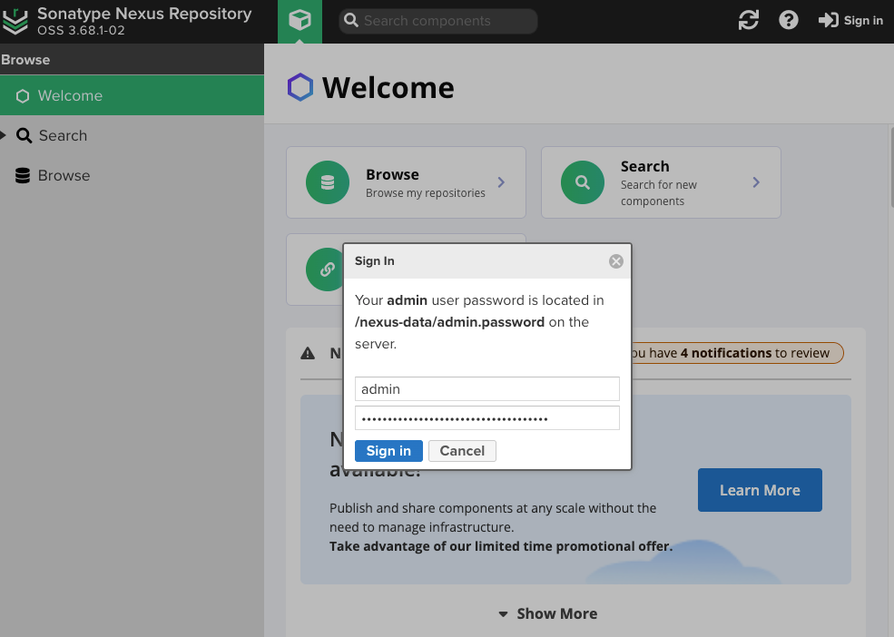

# Nexus私服
## Nexus3安装

### 1.准备数据目录

```shell
mkdir -pv /apps/nexus &&  cd /apps/nexus
mkdir nexus-data && chmod 777 nexus-data
```

### 2.准备docker-compose.yml
```shell
cat > docker-compose.yml <<'EOF'
version: '3.8'
services:
  nexus3:
    image: swr.cn-north-4.myhuaweicloud.com/ddn-k8s/docker.io/sonatype/nexus3:3.68.1-java11
    container_name: nexus3
    restart: always
    privileged: true
    ports:
      - "8081:8081"
    volumes:
      - ./nexus-data:/nexus-data
EOF
```
### 3.启动nexus
```shell
docker compose up -d && docker logs -f nexus3
```

### 4.访问Nexus3

```shell
~# docker exec -it nexus3 cat /nexus-data/admin.password
e97d703a-6621-4705-afd8-7277932ce37f
```

### 5.访问UI
访问地址：http://192.168.1.131:8081。首次登录需要强制修改密码

