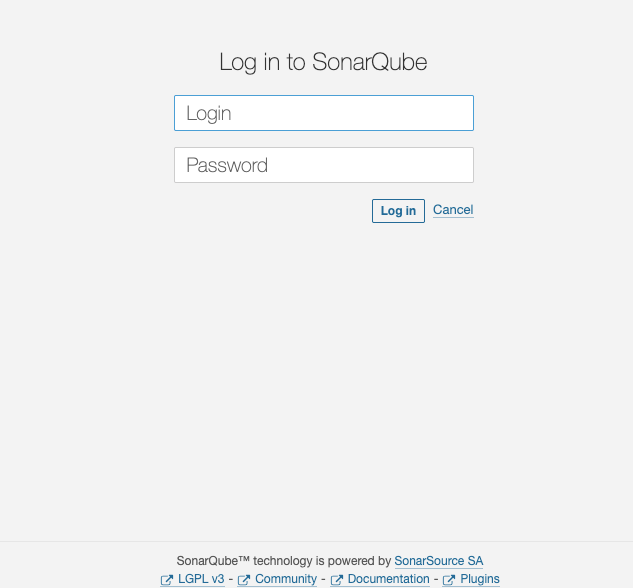
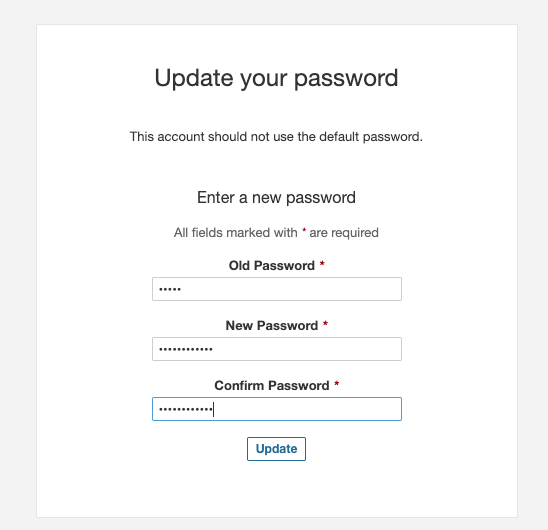
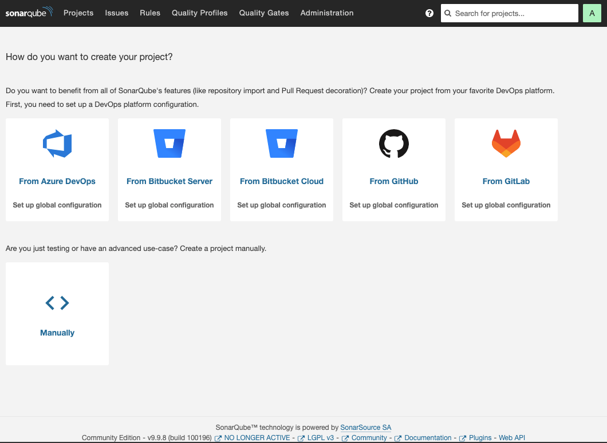

# SonarQube代码审查

## SonarQube安装

### 1.内核参数设置

```shell
sysctl -w vm.max_map_count=524288
sysctl -w fs.file-max=131072
ulimit -n 131072
ulimit -u 8192
echo "
sonarqube   -   nofile   131072
sonarqube   -   nproc    8192"| tee -a /etc/security/limits.conf
```

### 2.创建docker-compose.yml

```shell
mkdir -pv /apps/sonarqube/  && cd /apps/sonarqube/  && cat > docker-compose.yml  << 'EOF'
version: "3.8"
services:
  sonarqube:
    image: sonarqube:lts-community
    depends_on:
      - sonar_db
    environment:
      SONAR_JDBC_URL: jdbc:postgresql://sonar_db:5432/sonar
      SONAR_JDBC_USERNAME: sonar
      SONAR_JDBC_PASSWORD: sonar
    ports:
      - "9000:9000"
    volumes:
      - ./sonarqube/data:/opt/sonarqube/data


  sonar_db:
    image: postgres:13
    environment:
      POSTGRES_USER: sonar
      POSTGRES_PASSWORD: sonar
      POSTGRES_DB: sonar
    volumes:
      - ./sonar_db/data:/var/lib/postgresql/data
EOF
```

### 3.启动sonarqube
第一次启动会因为目录权限的问题启动不了,所以停止后，授权重新启动了一次

```shell
docker compose up  -d
docker compose down
chmod 777 -R sonarqube
docker compose up -d
```

### 4.访问sonarqube

访问地址 http://192.168.1.131:9000, 默认用户名密码为 admin，第一次登陆需要强制修改密码





### 5.[多分支插件](https://github.com/mc1arke/sonarqube-community-branch-plugin/tree/1.14.0)安装

挂载sonarqube配置文件和插件目录到本地

```shell
cd /apps/sonarqube
docker cp sonarqube:/opt/sonarqube/conf sonarqube/
docker cp sonarqube:/opt/sonarqube/extensions sonarqube/
docker cp sonarqube:/opt/sonarqube/logs sonarqube/
docker compose down
vim docker-compose.yml
    volumes:
      - ./sonarqube/data:/opt/sonarqube/data
      - ./sonarqube/conf:/opt/sonarqube/conf
      - ./sonarqube/extensions:/opt/sonarqube/extensions
      - ./sonarqube/logs:/opt/sonarqube/logs
docker compose up -d
```

```shell
cd /apps/sonarqube
cd sonarqube/extensions/plugins
wget https://ghfast.top/https://github.com/mc1arke/sonarqube-community-branch-plugin/releases/download/1.14.0/sonarqube-community-branch-plugin-1.14.0.jarcd /apps/sonarqube
echo "
sonar.web.javaAdditionalOpts=-javaagent:/opt/sonarqube/extensions/plugins/sonarqube-community-branch-plugin-1.14.0.jar=web
sonar.ce.javaAdditionalOpts=-javaagent:/opt/sonarqube/extensions/plugins/sonarqube-community-branch-plugin-1.14.0.jar=ce" |tee -a sonarqube/conf/sonar.properties
docker compose down
docker compose up
```
