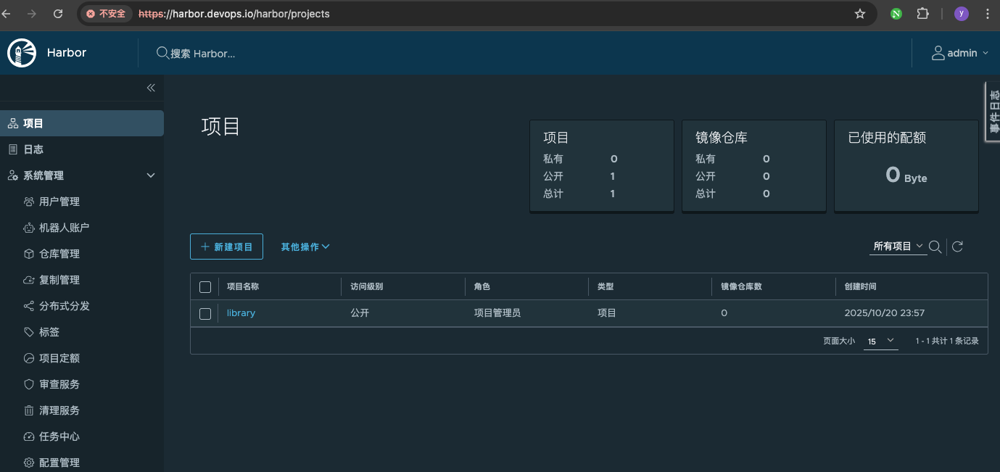

# 企业级Harbor镜像仓库

## 主机环境准备

使用Docker快速部署Harbor镜像仓库，操作系统为Ubuntu 24.04.2 LTS(noble)，用到的各相关程序版本如下:

### 1.主机名解析

```shell
hostnamectl  set-hostname harbor.devops.io
echo "192.168.1.250 harbor.devops.io harbor" >> /etc/hosts
```

### 2.关闭防火墙和selinux
```shell
systemctl disable --now ufw
```

### 3.时间同步

```shell
timedatectl  set-timezone Asia/Shanghai
apt install -y chrony
cat  > /etc/chrony/chrony.conf << 'EOF'
pool ntp.aliyun.com       iburst maxsources 4
keyfile /etc/chrony/chrony.keys
driftfile /var/lib/chrony/chrony.drift
logdir /var/log/chrony
maxupdateskew 100.0
rtcsync
makestep 1 3
EOF
systemctl restart chrony.service && systemctl  enable chrony.service
chronyc sources
```

### 4.开启内核转发

```shell
cat > /etc/sysctl.d/99-kubernetes-cri.conf <<EOF
net.bridge.bridge-nf-call-iptables  = 1
net.ipv4.ip_forward                 = 1
net.bridge.bridge-nf-call-ip6tables = 1
EOF
sysctl  --system
```

## 安装[docker](https://mirrors.huaweicloud.com/mirrorDetail/5ea14d84b58d16ef329c5c13?mirrorName=docker-ce&catalog=docker)

### 1.安装docker

```shell
sudo apt-get remove docker docker-engine docker.io
sudo apt-get install apt-transport-https ca-certificates curl gnupg2 software-properties-common
curl -fsSL https://mirrors.huaweicloud.com/docker-ce/linux/ubuntu/gpg | sudo apt-key add -
sudo add-apt-repository "deb [arch=amd64] https://mirrors.huaweicloud.com/docker-ce/linux/ubuntu $(lsb_release -cs) stable"
sudo apt-get update
sudo apt-get install -y docker-ce
 docker version
Client: Docker Engine - Community
 Version:           28.5.1
 API version:       1.51
 Go version:        go1.24.8
 Git commit:        e180ab8
 Built:             Wed Oct  8 12:17:26 2025
 OS/Arch:           linux/amd64
 Context:           default

Server: Docker Engine - Community
 Engine:
  Version:          28.5.1
  API version:      1.51 (minimum version 1.24)
  Go version:       go1.24.8
  Git commit:       f8215cc
  Built:            Wed Oct  8 12:17:26 2025
  OS/Arch:          linux/amd64
  Experimental:     false
 containerd:
  Version:          v1.7.28
  GitCommit:        b98a3aace656320842a23f4a392a33f46af97866
 runc:
  Version:          1.3.0
  GitCommit:        v1.3.0-0-g4ca628d1
 docker-init:
  Version:          0.19.0
  GitCommit:        de40ad0
```

### 2.配置docker数据目录

```shell
systemctl stop docker docker.socket
mkdir /data
mv /var/lib/docker /data/
ln -sv /data/docker /var/lib/docker
systemctl  enable docker --now
```

### 3.配置加速器

```shell
tee  /etc/docker/daemon.json << 'EOF'
{
    "exec-opts": ["native.cgroupdriver=systemd"],
    "registry-mirrors": [
         "https://o4uba187.mirror.aliyuncs.com",
         "https://docker.1ms.run",
         "https://docker.1panel.live"
    ]
}
EOF
systemctl daemon-reload
```

## 安装Harbor

### 1.获取[离线包](https://github.com/goharbor/harbor/releases)

```shell
wget https://ghfast.top/https://github.com/goharbor/harbor/releases/download/v2.14.0/harbor-offline-installer-v2.14.0.tgz
tar -xf harbor-offline-installer-v2.14.0.tgz  -C /data/
```

### 2.生成证书

```shell
mkdir /data/harbor/ssl
cd /data/harbor/ssl
# 1. Generate a CA certificate private key.
openssl genrsa -out ca.key 4096
# 2. Generate the CA certificate.
openssl req -x509 -new -nodes -sha512 -days 3650 \
 -subj "/C=CN/ST=Beijing/L=Beijing/O=example/OU=Personal/CN=harbor.devops.io" \
 -key ca.key \
 -out ca.crt
# 3. Generate a private key for harbor server.
openssl genrsa -out harbor.devops.io.key 4096
# 4. Generate a certificate signing request (CSR).
openssl req -sha512 -new \
    -subj "/C=CN/ST=Beijing/L=Beijing/O=example/OU=Personal/CN=harbor.devops.io" \
    -key harbor.devops.io.key \
    -out harbor.devops.io.csr
# 5. Generate an x509 v3 extension file.
cat > v3.ext <<-EOF
authorityKeyIdentifier=keyid,issuer
basicConstraints=CA:FALSE
keyUsage = digitalSignature, nonRepudiation, keyEncipherment, dataEncipherment
extendedKeyUsage = serverAuth
subjectAltName = @alt_names

[alt_names]
DNS.1=harbor.devops.io
DNS.2=harbor.devops.io
DNS.3=192.168.1.250
EOF
# 6. Use the v3.ext file to generate a certificate for your Harbor host.
openssl x509 -req -sha512 -days 3650 \
    -extfile v3.ext \
    -CA ca.crt -CAkey ca.key -CAcreateserial \
    -in harbor.devops.io.csr \
    -out harbor.devops.io.crt
Certificate request self-signature ok
subject=C = CN, ST = Beijing, L = Beijing, O = example, OU = Personal, CN = harbor.devops.io
```

### 3.配置harbor.yml

```shell
cd /data/harbor/
cp harbor.yml.tmpl harbor.yml
vim /data/harbor/harbor.yml
hostname: harbor.devops.io

# http related config
http:
  # port for http, default is 80. If https enabled, this port will redirect to https port
  port: 80

# https related config
https:
  # https port for harbor, default is 443
  port: 443
  # The path of cert and key files for nginx
  certificate: /data/harbor/ssl/harbor.devops.io.crt
  private_key: /data/harbor/ssl/harbor.devops.io.key
```

### 4.执行prepare脚本
```shell
docker load -i /data/harbor/harbor.v2.14.0.tar.gz
cd /data/harbor/ && ./prepare
```

### 5.执行install脚本

```shell
./install.sh
```

### 6.访问UI



## 配置docker使用

### 1.配置认证证书
```shell
# 转换证书
cd /data/harbor/ssl
openssl x509 -inform PEM -in harbor.devops.io.crt -out harbor.devops.io.cert

mkdir -pv  /etc/docker/certs.d/harbor.devops.io/
cp /data/harbor/ssl/{harbor.devops.io.cert,harbor.devops.io.key,ca.crt} /etc/docker/certs.d/harbor.devops.io/
```
### 2.上传镜像
```shell
docker pull ikubernetes/myapp:v1
docker tag  ikubernetes/myapp:v1 harbor.devops.io/library/myapp:v1
docker login harbor.devops.io -u admin -p Harbor12345
docker push harbor.devops.io/library/myapp:v1
```

## [配置containerd使用](https://github.com/containerd/containerd/blob/main/docs/hosts.md)

```shell
# 配置config_path路径
grep -B 2 config_path /etc/containerd/config.toml
    [plugins."io.containerd.grpc.v1.cri".registry]
      config_path = "/etc/containerd/certs.d"
systemctl restart containerd
mkdir -pv /etc/containerd/certs.d/harbor.devops.io
scp harbor.devops.io:/data/harbor/ssl/ca.crt /etc/containerd/certs.d/harbor.devops.io
cat > /etc/containerd/certs.d/harbor.devops.io/hosts.toml  << 'EOF'
server = "https://harbor.devops.io"
[host."https://harbor.devops.io"]
  capabilities = ["pull", "resolve","push"]
  skip_verify = false
  ca = ["ca.crt"]
EOF
```

### 1.配置Pod拉去Secret

```shell
kubectl create secret docker-registry harbor-secret \
  --docker-server=harbor.devops.io \
  --docker-username=admin \
  --docker-password=Harbor12345 \
  --docker-email=harbro@devops.com \
  -n default

cat myapp.yaml
---
apiVersion: apps/v1
kind: Deployment
metadata:
  labels:
    app: myapp
  name: myapp
  namespace: default
spec:
  progressDeadlineSeconds: 600
  replicas: 3
  revisionHistoryLimit: 10
  selector:
    matchLabels:
      app: myapp
  strategy:
    rollingUpdate:
      maxSurge: 25%
      maxUnavailable: 25%
    type: RollingUpdate
  template:
    metadata:
      labels:
        app: myapp
    spec:
      imagePullSecrets:
        - name: harbor-secret
      containers:
      - image: harbor.devops.io/baseimages/myapp:v1
        imagePullPolicy: IfNotPresent
        name: myapp
      restartPolicy: Always
```
