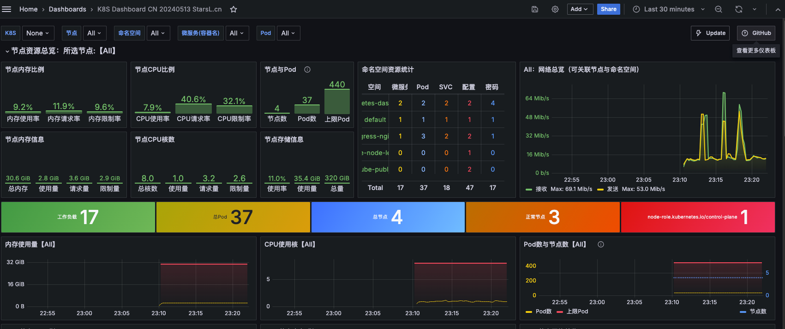
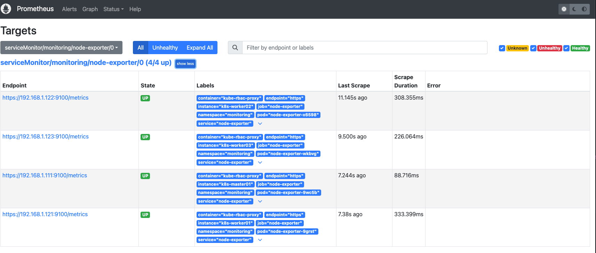
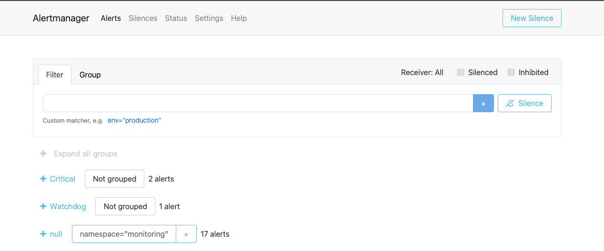
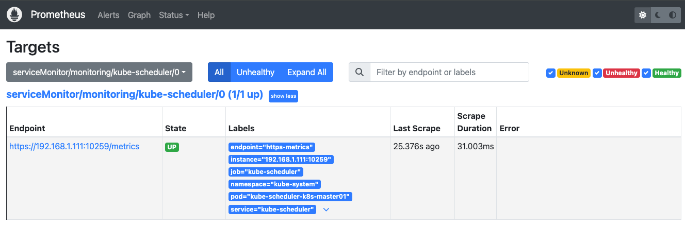
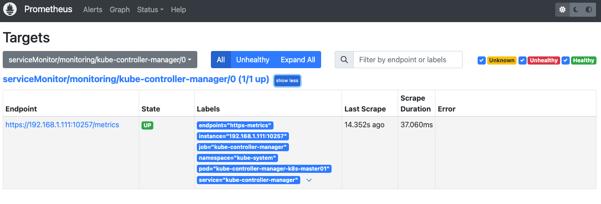

# Kube-prometheus


## Kube-prometheus 安装

Kubernetes 集群版本为 1.30.x, 所以选择 [releae-0.14](https://github.com/prometheus-operator/kube-prometheus/tree/release-0.14)的分支

### 1.创建namespace & CRD资源
```shell
~# git clone -b release-0.14 https://ghfast.top/https://github.com/prometheus-operator/kube-prometheus.git
~# cd kube-prometheus/
~/kube-prometheus# kubectl apply --server-side -f manifests/setup
```

### 2.持久化数据

```shell
# prometheus数据持久化
~/kube-prometheus# vim manifests/prometheus-prometheus.yaml
  ...
  version: 2.54.1
  # 数据持久化 ,添加如下内容
  retention: 180d
  storage:
    volumeClaimTemplate:
      spec:
        storageClassName: nfs-client
        accessModes: ["ReadWriteOnce"]
        resources:
          requests:
            storage: 200Gi
# alertmanager数据持久化
~/kube-prometheus# vim manifests/alertmanager-alertmanager.yaml
  ...
  version: 0.27.0
  # 添加如下内容:
  storage:
    volumeClaimTemplate:
      spec:
        storageClassName: nfs-client
        accessModes: ["ReadWriteOnce"]
        resources:
          requests:
            storage: 10Gi

# Grafana 数据持久化
~/kube-prometheus# cat > manifests/grafana-pvc.yaml << EOF
---
apiVersion: v1
kind: PersistentVolumeClaim
metadata:
  name: grafana-pvc
  namespace: monitoring
spec:
  storageClassName: nfs-client
  accessModes:
    - ReadWriteOnce
  resources:
    requests:
      storage: 10Gi
EOF
~/kube-prometheus# vim manifests/grafana-deployment.yaml
      ...
      volumes:
      # 注释下面的内容，声明使用的PVC
      #- emptyDir: {}
      #  name: grafana-storage
      - name: grafana-storage
        persistentVolumeClaim:
          claimName: grafana-pvc

```
### 3.应用资源清单

```shell
~/kube-prometheus# kubectl apply -f manifests/
~/kube-prometheus# kubectl  get pod -n monitoring
NAME                                   READY   STATUS    RESTARTS      AGE
alertmanager-main-0                    2/2     Running   0             68m
alertmanager-main-1                    2/2     Running   0             68m
alertmanager-main-2                    2/2     Running   0             3m2s
blackbox-exporter-74465f5fcb-jjgnz     3/3     Running   0             42m
grafana-6c8dbb8d74-5n9gz               1/1     Running   0             42m
kube-state-metrics-59dcf5dbb-28cr7     3/3     Running   0             33m
node-exporter-9grst                    2/2     Running   4 (25m ago)   26m
node-exporter-9wc5b                    2/2     Running   0             70m
node-exporter-wkbvg                    2/2     Running   0             70m
node-exporter-x6598                    2/2     Running   0             70m
prometheus-adapter-5794d7d9f5-45xkc    1/1     Running   0             5m37s
prometheus-adapter-5794d7d9f5-rkqxm    1/1     Running   0             70m
prometheus-k8s-0                       2/2     Running   0             9m42s
prometheus-k8s-1                       2/2     Running   0             13m
prometheus-operator-6f948f56f8-5ltl8   2/2     Running   0             70m
```
### 4.使用NodePort暴露服务

```shell
# prometheus http://192.168.1.111:32090
kubectl patch svc prometheus-k8s -n monitoring --type='merge' -p '{
  "spec": {
    "type": "NodePort",
    "ports": [{
      "port": 9090,
      "targetPort": 9090,
      "nodePort": 32090
    }]
  }
}'
# grafana http://192.168.1.111:32030
kubectl patch svc grafana -n monitoring --type='merge' -p '{
  "spec": {
    "type": "NodePort",
    "ports": [{
      "port": 3000,
      "targetPort": 3000,
      "nodePort": 32030
    }]
  }
}'
# alertmanager http://192.168.1.111:32093
kubectl patch svc alertmanager-main -n monitoring --type='merge' -p '{
  "spec": {
    "type": "NodePort",
    "ports": [{
      "port": 9093,
      "targetPort": 9093,
      "nodePort": 32093
    }]
  }
}'
```
```shell
~/kube-prometheus# kubectl  get svc -n monitoring
NAME                    TYPE        CLUSTER-IP      EXTERNAL-IP   PORT(S)                      AGE
alertmanager-main       NodePort    10.96.230.59    <none>        9093:32093/TCP               13m
alertmanager-operated   ClusterIP   None            <none>        9093/TCP,9094/TCP,9094/UDP   10m
blackbox-exporter       ClusterIP   10.108.70.44    <none>        9115/TCP,19115/TCP           13m
grafana                 NodePort    10.105.56.212   <none>        3000:32030/TCP               13m
kube-state-metrics      ClusterIP   None            <none>        8443/TCP,9443/TCP            13m
node-exporter           ClusterIP   None            <none>        9100/TCP                     13m
prometheus-adapter      ClusterIP   10.104.18.220   <none>        443/TCP                      13m
prometheus-k8s          NodePort    10.110.45.160   <none>        9090:32090/TCP               13m
prometheus-operated     ClusterIP   None            <none>        9090/TCP                     10m
prometheus-operator     ClusterIP   None            <none>        8443/TCP                     13m
```
### 5.删除默认的网路策略

需要删除默认的访问策略才能访问到UI
```shell
~/kube-prometheus# kubectl  delete  networkpolicy -n monitoring --all
```

访问Grafana Dashboard ID: [13105](https://grafana.com/grafana/dashboards/13105-k8s-dashboard-cn-20240513-starsl-cn/)



访问Prometheus UI



访问Alertmanager UI



### 6.完善监控

#### 6.1.添加kube-scheduler自动发现

- 查看 kube-scheduler 的Service monitoring定义

```shell
~/kube-prometheus# cat manifests/kubernetesControlPlane-serviceMonitorKubeScheduler.yaml
apiVersion: monitoring.coreos.com/v1
kind: ServiceMonitor
metadata:
  labels:
    app.kubernetes.io/name: kube-scheduler
    app.kubernetes.io/part-of: kube-prometheus
  name: kube-scheduler
  namespace: monitoring
spec:
  endpoints:
  - bearerTokenFile: /var/run/secrets/kubernetes.io/serviceaccount/token
    interval: 30s
    port: https-metrics
    scheme: https
    tlsConfig:
      insecureSkipVerify: true
  - bearerTokenFile: /var/run/secrets/kubernetes.io/serviceaccount/token
    interval: 5s
    metricRelabelings:
    - action: drop
      regex: process_start_time_seconds
      sourceLabels:
      - __name__
    path: /metrics/slis
    port: https-metrics
    scheme: https
    tlsConfig:
      insecureSkipVerify: true
  jobLabel: app.kubernetes.io/name
  # 通过 selector.matchLabels 匹配 kube-system 这个命名空间下面匹配具有 app.kubernetes.io/name=kube-scheduler标签的 Service 实现自动发现
  namespaceSelector:
    matchNames:
    - kube-system
  selector:
    matchLabels:
      app.kubernetes.io/name: kube-scheduler
# 因为匹配不到所以没法自动发现
~/kube-prometheus# kubectl get svc -n kube-system -l app.kubernetes.io/name=kube-scheduler
No resources found in kube-system namespace.
```

- 创建具有app.kubernetes.io/name=kube-scheduler标签的 Service 与 ServiceMonitor 进行关联

```shell
# 1. 调整 kube-schduler 静态Pod监听端口为 0.0.0.0
~# vim /etc/kubernetes/manifests/kube-scheduler.yaml
...
spec:
  containers:
  - command:
    - kube-scheduler
    - --authentication-kubeconfig=/etc/kubernetes/scheduler.conf
    - --authorization-kubeconfig=/etc/kubernetes/scheduler.conf
    - --bind-address=0.0.0.0
    - --kubeconfig=/etc/kubernetes/scheduler.conf
    - --leader-elect=true

~# ss -tnlp|grep 10259
LISTEN 0      32768              *:10259            *:*    users:(("kube-scheduler",pid=95096,fd=3))
# 2. 查看当前集群Pod的 Labels
~# kubectl describe pod kube-scheduler-k8s-master01 -n kube-system|grep -A 3 -i labels
Labels:               component=kube-scheduler
                      tier=control-plane
Annotations:          kubernetes.io/config.hash: d1f57ab34ed2be162a945560c9491ada
                      kubernetes.io/config.mirror: d1f57ab34ed2be162a945560c9491ada
# 3.创建Service对象
~/kube-prometheus# cat  > exts/kube-scheduler-service.yaml << 'EOF'
apiVersion: v1
kind: Service
metadata:
  namespace: kube-system
  name: kube-scheduler
  labels: # 必须和上面的 ServiceMonitor 下面的 matchLabels 保持一致
    app.kubernetes.io/name: kube-scheduler
spec:
  selector:
    component: kube-scheduler
  ports:
    - name: https-metrics
      port: 10259
      targetPort: 10259 # 需要注意现在版本默认的安全端口是10259
EOF
~/kube-prometheus# kubectl  apply -f exts/kube-scheduler-service.yaml
~# kubectl get svc -n kube-system -l app.kubernetes.io/name=kube-scheduler
NAME             TYPE        CLUSTER-IP      EXTERNAL-IP   PORT(S)     AGE
kube-scheduler   ClusterIP   10.98.202.176   <none>        10259/TCP   53s
```

- 验证




#### 6.2.添加kube-controller自动发现

- 查看 kube-controller 的Service monitoring定义

```shell
~/kube-prometheus# cat manifests/kubernetesControlPlane-serviceMonitorKubeControllerManager.yaml
...
  jobLabel: app.kubernetes.io/name
  namespaceSelector:
    matchNames:
    - kube-system
  selector:
    matchLabels:
      app.kubernetes.io/name: kube-controller-manager
~# kubectl get svc -n kube-system -l app.kubernetes.io/name=kube-controller-manager
No resources found in kube-system namespace.
```

- 创建具有app.kubernetes.io/name=kube-controller-manager标签的 Service 与 ServiceMonitor 进行关联

```shell
#1. 调整 kube-controller-manager 静态Pod监听端口为 0.0.0.0
~# vim /etc/kubernetes/manifests/kube-controller-manager.yaml
...
spec:
  containers:
  - command:
    - kube-controller-manager
    - --allocate-node-cidrs=true
    - --authentication-kubeconfig=/etc/kubernetes/controller-manager.conf
    - --authorization-kubeconfig=/etc/kubernetes/controller-manager.conf
    - --bind-address=0.0.0.0

~# ss -tnlp|grep 10257
LISTEN 0      32768              *:10257            *:*    users:(("kube-controller",pid=104599,fd=3))

# 2. 查看当前集群Pod的 Labels
~# kubectl describe pod kube-controller-manager-k8s-master01 -n kube-system|grep -A 3 -i labels
Labels:               component=kube-controller-manager
                      tier=control-plane
Annotations:          kubernetes.io/config.hash: 67b54a7b4d3cbd022f613343762566c7
                      kubernetes.io/config.mirror: 67b54a7b4d3cbd022f613343762566c7
# 3.创建Service对象
~/kube-prometheus# cat  > exts/kube-controller-manager-service.yaml << 'EOF'
apiVersion: v1
kind: Service
metadata:
  namespace: kube-system
  name: kube-controller-manager
  labels:
    app.kubernetes.io/name: kube-controller-manager
spec:
  selector:
    component: kube-controller-manager
  ports:
    - name: https-metrics
      port: 10257
      targetPort: 10257 # controller-manager 的安全端口为10257
EOF
~/kube-prometheus# kubectl apply -f exts/kube-controller-manager-service.yaml
~/kube-prometheus# kubectl get svc -n kube-system -l app.kubernetes.io/name=kube-controller-manager
NAME                      TYPE        CLUSTER-IP      EXTERNAL-IP   PORT(S)     AGE
kube-controller-manager   ClusterIP   10.98.144.138   <none>        10257/TCP   34s
```

- 验证


### 6.卸载

```shell
~/kube-prometheus# kubectl delete --ignore-not-found=true -f manifests/ -f manifests/setup
```
