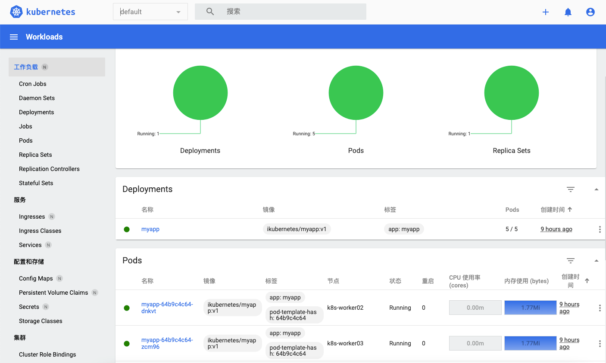

# Kubeadm 安装 Kubernetes v1.30.12(Containerd)

## 主机环境准备
使用Kubeadm快速部署Kubernetes集群，操作系统为Ubuntu 24.04.2 LTS(noble)，用到的各相关程序版本如下:

- Kubernetes: v1.30.12
- Contianerd: v1.7.28
- Calico: v3.29.6

| 主机名          | IP            | 角色     |
|--------------|---------------|--------|
| k8s-master01 | 192.168.1.111 | master |
| k8s-worker01 | 192.168.1.121 | worker |
| k8s-worker02 | 192.168.1.122 | worker |
| k8s-worker03 | 192.168.1.123 | worker |

### 1.配置国内源

- [Apt源码](https://developer.aliyun.com/mirror/ubuntu?spm=a2c6h.13651102.0.0.3e221b11e0gYK2)

```shell
cat > /etc/apt/sources.list.d/ubuntu.list << 'EOF'
deb https://mirrors.aliyun.com/ubuntu/ noble main restricted universe multiverse
deb-src https://mirrors.aliyun.com/ubuntu/ noble main restricted universe multiverse

deb https://mirrors.aliyun.com/ubuntu/ noble-security main restricted universe multiverse
deb-src https://mirrors.aliyun.com/ubuntu/ noble-security main restricted universe multiverse

deb https://mirrors.aliyun.com/ubuntu/ noble-updates main restricted universe multiverse
deb-src https://mirrors.aliyun.com/ubuntu/ noble-updates main restricted universe multiverse

# deb https://mirrors.aliyun.com/ubuntu/ noble-proposed main restricted universe multiverse
# deb-src https://mirrors.aliyun.com/ubuntu/ noble-proposed main restricted universe multiverse

deb https://mirrors.aliyun.com/ubuntu/ noble-backports main restricted universe multiverse
deb-src https://mirrors.aliyun.com/ubuntu/ noble-backports main restricted universe multiverse
EOF
```

- [Docker源](https://developer.aliyun.com/mirror/docker-ce?spm=a2c6h.13651102.0.0.3e221b11e0gYK2)

```shell
# step 1: 安装必要的一些系统工具
sudo apt-get update
sudo apt-get install ca-certificates curl gnupg

# step 2: 信任 Docker 的 GPG 公钥
sudo install -m 0755 -d /etc/apt/keyrings
curl -fsSL https://mirrors.aliyun.com/docker-ce/linux/ubuntu/gpg | sudo gpg --dearmor -o /etc/apt/keyrings/docker.gpg
sudo chmod a+r /etc/apt/keyrings/docker.gpg

# Step 3: 写入软件源信息
echo \
  "deb [arch=$(dpkg --print-architecture) signed-by=/etc/apt/keyrings/docker.gpg] https://mirrors.aliyun.com/docker-ce/linux/ubuntu \
  "$(. /etc/os-release && echo "$VERSION_CODENAME")" stable" | \
  sudo tee /etc/apt/sources.list.d/docker.list > /dev/null

# Step 4: 安装Docker
sudo apt-get update
# 安装指定版本的Docker-CE:
# Step 1: 查找Docker-CE的版本:
# apt-cache madison docker-ce
#   docker-ce | 17.03.1~ce-0~ubuntu-xenial | https://mirrors.aliyun.com/docker-ce/linux/ubuntu xenial/stable amd64 Packages
#   docker-ce | 17.03.0~ce-0~ubuntu-xenial | https://mirrors.aliyun.com/docker-ce/linux/ubuntu xenial/stable amd64 Packages
# Step 2: 安装指定版本的Docker-CE: (VERSION例如上面的17.03.1~ce-0~ubuntu-xenial)
# sudo apt-get -y install docker-ce=[VERSION]
```

- [Kubernetes源](https://developer.aliyun.com/mirror/kubernetes?spm=a2c6h.13651102.0.0.3e221b11e0gYK2)

```shell
apt-get update && apt-get install -y apt-transport-https
curl -fsSL https://mirrors.aliyun.com/kubernetes-new/core/stable/v1.30/deb/Release.key |
    gpg --dearmor -o /etc/apt/keyrings/kubernetes-apt-keyring.gpg
echo "deb [signed-by=/etc/apt/keyrings/kubernetes-apt-keyring.gpg] https://mirrors.aliyun.com/kubernetes-new/core/stable/v1.30/deb/ /" |
    tee /etc/apt/sources.list.d/kubernetes.list
apt-get update
```

### 2.主机名解析

```shell
cat >> /etc/hosts << 'EOF'
192.168.1.111 k8s-master01
192.168.1.121 k8s-worker01
192.168.1.122 k8s-worker02
192.168.1.123 k8s-worker03
# k8s-vip 预留后期扩展高可用集群
192.168.1.111 k8s-vip
EOF
```

### 3.关闭防火墙和selinux(Ubuntu不用管SELinux)

```shell
sed -i 's/.*swap.*/#&/' /etc/fstab
swapoff -a && sysctl -w vm.swappiness=0
systemctl  mask swap.target
```

### 4.关闭swap分区
```shell
sed -i 's/.*swap.*/#&/' /etc/fstab
swapoff -a && sysctl -w vm.swappiness=0
systemctl  mask swap.target
```

### 5.时区跟时间同步

```shell
timedatectl  set-timezone Asia/Shanghai
apt install -y chrony
cat  > /etc/chrony/chrony.conf << 'EOF'
pool ntp.aliyun.com       iburst maxsources 4
keyfile /etc/chrony/chrony.keys
driftfile /var/lib/chrony/chrony.drift
logdir /var/log/chrony
maxupdateskew 100.0
rtcsync
makestep 1 3
EOF
systemctl restart chrony.service && systemctl  enable chrony.service
chronyc sources
MS Name/IP address         Stratum Poll Reach LastRx Last sample
===============================================================================
^* 203.107.6.88                  2   6     7     1  -4176us[ +806us] +/-   29ms
```
### 6.加载IPVS模块

```shell
apt install ipset ipvsadm -y
cat >> /etc/modules-load.d/k8s.conf << 'EOF'
br_netfilter
ip_vs
ip_vs_rr
ip_vs_wrr
ip_vs_sh
nf_conntrack
nf_nat
overlay
vxlan
iptable_nat
xt_MASQUERADE
EOF
systemctl restart systemd-modules-load
lsmod | grep -E 'br_netfilter|ip_vs|nf_conntrack|overlay|vxlan'
```

### 7.内核参数优化

```shell
cat > /etc/sysctl.d/k8s.conf << 'EOF'
# 开启IPv4转发
net.ipv4.ip_forward = 1
# 允许桥接的流量进入iptables/netfilter
net.bridge.bridge-nf-call-iptables = 1
net.bridge.bridge-nf-call-ip6tables = 1
# 优化连接跟踪表大小，防止大规模连接爆掉
net.netfilter.nf_conntrack_max = 2310720
# TCP优化（缩短 TIME_WAIT，快速回收连接）
net.ipv4.tcp_tw_reuse = 1
net.ipv4.tcp_fin_timeout = 15
net.ipv4.tcp_keepalive_time = 600
net.ipv4.tcp_keepalive_intvl = 30
net.ipv4.tcp_keepalive_probes = 5
# 内存相关优化（防止OOM）
vm.swappiness = 0
vm.overcommit_memory = 1
vm.panic_on_oom = 0
# 文件句柄限制
fs.file-max = 52706963
# 网络层面优化
net.core.somaxconn = 32768
net.core.netdev_max_backlog = 16384
net.ipv4.tcp_max_syn_backlog = 16384
EOF
sysctl --system
cat >> /etc/security/limits.conf << 'EOF'
* soft nofile 1048576
* hard nofile 1048576
* soft nproc 1048576
* hard nproc 1048576
* soft memlock unlimited
* hard memlock unlimited
EOF
ulimit  -n 64435
ulimit  -s 10240
```

## 安装容器运行时

### 1.安装指定版本的容器运行时

```shell
apt-cache madison containerd
apt install -y containerd=1.7.28-0ubuntu1~24.04.1
```
### 2.配置contianerd

```shell
mkdir -pv /etc/containerd
containerd config default | sudo tee /etc/containerd/config.toml
# 修改cgroup Driver为systemd
sed -ri 's@SystemdCgroup = false@SystemdCgroup = true@' /etc/containerd/config.toml
# 更改sandbox_image
sed -ri 's@registry.k8s.io\/pause:3.8@registry.cn-hangzhou.aliyuncs.com\/google_containers\/pause:3.9@' /etc/containerd/config.toml
# 配置containerd 的镜像存储目录
sed -i 's@root = "/var/lib/containerd"@root = "/data/containerd"@g' /etc/containerd/config.toml
```

### 3.配置加速器

```shell
sed -i 's@config_path = ""@config_path = "\/etc\/containerd\/certs.d\/"@g' /etc/containerd/config.toml
# docker.io 镜像加速
mkdir -p /etc/containerd/certs.d/docker.io
cat > /etc/containerd/certs.d/docker.io/hosts.toml << 'EOF'
server = "https://docker.io" # 源镜像地址

[host."https://docker.1ms.run"]
  capabilities = ["pull","resolve"]

[host."https://docker.m.daocloud.io"] # 道客-镜像加速地址
  capabilities = ["pull","resolve"]

[host."https://dockerproxy.com"] # 镜像加速地址
  capabilities = ["pull", "resolve"]

[host."https://docker.mirrors.sjtug.sjtu.edu.cn"] # 上海交大-镜像加速地址
  capabilities = ["pull","resolve"]

[host."https://docker.mirrors.ustc.edu.cn"] # 中科大-镜像加速地址
  capabilities = ["pull","resolve"]

[host."https://docker.nju.edu.cn"] # 南京大学-镜像加速地址
  capabilities = ["pull","resolve"]

[host."https://registry-1.docker.io"]
  capabilities = ["pull","resolve","push"]
EOF

# registry.k8s.io 镜像加速
mkdir -p /etc/containerd/certs.d/registry.k8s.io
cat > /etc/containerd/certs.d/registry.k8s.io/hosts.toml << 'EOF'
server = "https://registry.k8s.io"

[host."https://k8s.m.daocloud.io"]
  capabilities = ["pull", "resolve", "push"]
EOF

# quay.io 镜像加速
mkdir -p /etc/containerd/certs.d/quay.io
cat > /etc/containerd/certs.d/quay.io/hosts.toml << 'EOF'
server = "https://quay.io"

[host."https://quay.m.daocloud.io"]
  capabilities = ["pull", "resolve", "push"]
EOF

# docker.elastic.co镜像加速
mkdir -p /etc/containerd/certs.d/docker.elastic.co
tee /etc/containerd/certs.d/docker.elastic.co/hosts.toml << 'EOF'
server = "https://docker.elastic.co"

[host."https://elastic.m.daocloud.io"]
  capabilities = ["pull", "resolve", "push"]
EOF
systemctl daemon-reload &&  systemctl restart containerd && systemctl enable containerd
```
### 4.安装crictl客户端

```shell
wget https://ghfast.top/https://github.com/kubernetes-sigs/cri-tools/releases/download/v1.24.0/crictl-v1.24.0-linux-amd64.tar.gz
tar -zxvf crictl-v1.24.0-linux-amd64.tar.gz -C /usr/local/bin
cat > /etc/crictl.yaml <<EOF
runtime-endpoint: unix:///var/run/containerd/containerd.sock
image-endpoint: unix:///var/run/containerd/containerd.sock
timeout: 10
debug: false
pull-image-on-create: false
EOF
```

## 安装Kubernetes集群

### 1.安装kubeadm软件包

```shell
apt-cache madison kubeadm
apt install kubeadm=1.30.12-1.1 kubelet=1.30.12-1.1 kubectl=1.30.12-1.1
```

### 2.配置kubelet开机自启

```shell
systemctl enable --now kubelet
```

### 3.集群安装

#### 3.1.Master 节点初始化
```shell
# 提前拉取镜像
kubeadm config images pull --image-repository=registry.cn-hangzhou.aliyuncs.com/google_containers --kubernetes-version=1.30.12
kubeadm init \
  --kubernetes-version=1.30.12 \
  --control-plane-endpoint="k8s-vip" \
  --image-repository=registry.cn-hangzhou.aliyuncs.com/google_containers \
  --pod-network-cidr=10.244.0.0/16 \
  --service-cidr=10.96.0.0/12 \
  --token-ttl=0 \
  --upload-certs|tee kubeadm.log
[init] Using Kubernetes version: v1.30.12
[preflight] Running pre-flight checks
[preflight] Pulling images required for setting up a Kubernetes cluster
[preflight] This might take a minute or two, depending on the speed of your internet connection
[preflight] You can also perform this action in beforehand using 'kubeadm config images pull'
[certs] Using certificateDir folder "/etc/kubernetes/pki"
[certs] Generating "ca" certificate and key
[certs] Generating "apiserver" certificate and key
[certs] apiserver serving cert is signed for DNS names [k8s-master01 k8s-vip kubernetes kubernetes.default kubernetes.default.svc kubernetes.default.svc.cluster.local] and IPs [10.96.0.1 192.168.1.111]
[certs] Generating "apiserver-kubelet-client" certificate and key
[certs] Generating "front-proxy-ca" certificate and key
[certs] Generating "front-proxy-client" certificate and key
[certs] Generating "etcd/ca" certificate and key
[certs] Generating "etcd/server" certificate and key
[certs] etcd/server serving cert is signed for DNS names [k8s-master01 localhost] and IPs [192.168.1.111 127.0.0.1 ::1]
[certs] Generating "etcd/peer" certificate and key
[certs] etcd/peer serving cert is signed for DNS names [k8s-master01 localhost] and IPs [192.168.1.111 127.0.0.1 ::1]
[certs] Generating "etcd/healthcheck-client" certificate and key
[certs] Generating "apiserver-etcd-client" certificate and key
[certs] Generating "sa" key and public key
[kubeconfig] Using kubeconfig folder "/etc/kubernetes"
[kubeconfig] Writing "admin.conf" kubeconfig file
[kubeconfig] Writing "super-admin.conf" kubeconfig file
[kubeconfig] Writing "kubelet.conf" kubeconfig file
[kubeconfig] Writing "controller-manager.conf" kubeconfig file
[kubeconfig] Writing "scheduler.conf" kubeconfig file
[etcd] Creating static Pod manifest for local etcd in "/etc/kubernetes/manifests"
[control-plane] Using manifest folder "/etc/kubernetes/manifests"
[control-plane] Creating static Pod manifest for "kube-apiserver"
[control-plane] Creating static Pod manifest for "kube-controller-manager"
[control-plane] Creating static Pod manifest for "kube-scheduler"
[kubelet-start] Writing kubelet environment file with flags to file "/var/lib/kubelet/kubeadm-flags.env"
[kubelet-start] Writing kubelet configuration to file "/var/lib/kubelet/config.yaml"
[kubelet-start] Starting the kubelet
[wait-control-plane] Waiting for the kubelet to boot up the control plane as static Pods from directory "/etc/kubernetes/manifests"
[kubelet-check] Waiting for a healthy kubelet at http://127.0.0.1:10248/healthz. This can take up to 4m0s
[kubelet-check] The kubelet is healthy after 1.002218069s
[api-check] Waiting for a healthy API server. This can take up to 4m0s
[api-check] The API server is healthy after 5.504002718s
[upload-config] Storing the configuration used in ConfigMap "kubeadm-config" in the "kube-system" Namespace
[kubelet] Creating a ConfigMap "kubelet-config" in namespace kube-system with the configuration for the kubelets in the cluster
[upload-certs] Storing the certificates in Secret "kubeadm-certs" in the "kube-system" Namespace
[upload-certs] Using certificate key:
b02bcd4ca23ffb9ea4aaf72cd7fecb745592efd7acb50ce49d651b0c676780c5
[mark-control-plane] Marking the node k8s-master01 as control-plane by adding the labels: [node-role.kubernetes.io/control-plane node.kubernetes.io/exclude-from-external-load-balancers]
[mark-control-plane] Marking the node k8s-master01 as control-plane by adding the taints [node-role.kubernetes.io/control-plane:NoSchedule]
[bootstrap-token] Using token: 2zzmat.b1omkhqhuns4s30x
[bootstrap-token] Configuring bootstrap tokens, cluster-info ConfigMap, RBAC Roles
[bootstrap-token] Configured RBAC rules to allow Node Bootstrap tokens to get nodes
[bootstrap-token] Configured RBAC rules to allow Node Bootstrap tokens to post CSRs in order for nodes to get long term certificate credentials
[bootstrap-token] Configured RBAC rules to allow the csrapprover controller automatically approve CSRs from a Node Bootstrap Token
[bootstrap-token] Configured RBAC rules to allow certificate rotation for all node client certificates in the cluster
[bootstrap-token] Creating the "cluster-info" ConfigMap in the "kube-public" namespace
[kubelet-finalize] Updating "/etc/kubernetes/kubelet.conf" to point to a rotatable kubelet client certificate and key
[addons] Applied essential addon: CoreDNS
[addons] Applied essential addon: kube-proxy

Your Kubernetes control-plane has initialized successfully!

To start using your cluster, you need to run the following as a regular user:

  mkdir -p $HOME/.kube
  sudo cp -i /etc/kubernetes/admin.conf $HOME/.kube/config
  sudo chown $(id -u):$(id -g) $HOME/.kube/config

Alternatively, if you are the root user, you can run:

  export KUBECONFIG=/etc/kubernetes/admin.conf

You should now deploy a pod network to the cluster.
Run "kubectl apply -f [podnetwork].yaml" with one of the options listed at:
  https://kubernetes.io/docs/concepts/cluster-administration/addons/

You can now join any number of the control-plane node running the following command on each as root:

  kubeadm join k8s-vip:6443 --token 2zzmat.b1omkhqhuns4s30x \
	--discovery-token-ca-cert-hash sha256:66d67a3c65fb6a32e5e67b1194ec9a49fc826f1ae1d9ab92b3a2932e49a82d5e \
	--control-plane --certificate-key b02bcd4ca23ffb9ea4aaf72cd7fecb745592efd7acb50ce49d651b0c676780c5

Please note that the certificate-key gives access to cluster sensitive data, keep it secret!
As a safeguard, uploaded-certs will be deleted in two hours; If necessary, you can use
"kubeadm init phase upload-certs --upload-certs" to reload certs afterward.

Then you can join any number of worker nodes by running the following on each as root:

kubeadm join k8s-vip:6443 --token 2zzmat.b1omkhqhuns4s30x \
	--discovery-token-ca-cert-hash sha256:66d67a3c65fb6a32e5e67b1194ec9a49fc826f1ae1d9ab92b3a2932e49a82d5e
```
#### 3.2.配置kubectl命令

```shell
mkdir -p $HOME/.kube
sudo cp -i /etc/kubernetes/admin.conf $HOME/.kube/config
sudo chown $(id -u):$(id -g) $HOME/.kube/config
kubectl  get nodes
NAME           STATUS     ROLES           AGE    VERSION
k8s-master01   NotReady   control-plane   107s   v1.30.12
kubectl  get pods -A
NAMESPACE     NAME                                   READY   STATUS    RESTARTS   AGE
kube-system   coredns-6d58d46f65-2fg6x               0/1     Pending   0          93s
kube-system   coredns-6d58d46f65-p66nm               0/1     Pending   0          93s
kube-system   etcd-k8s-master01                      1/1     Running   0          107s
kube-system   kube-apiserver-k8s-master01            1/1     Running   0          107s
kube-system   kube-controller-manager-k8s-master01   1/1     Running   0          110s
kube-system   kube-proxy-m2wnr                       1/1     Running   0          93s
kube-system   kube-scheduler-k8s-master01            1/1     Running   0          109s
```

#### 3.3.加入worker节点

```shell
kubeadm join k8s-vip:6443 --token 2zzmat.b1omkhqhuns4s30x \
	--discovery-token-ca-cert-hash sha256:66d67a3c65fb6a32e5e67b1194ec9a49fc826f1ae1d9ab92b3a2932e49a82d5e
kubectl  get nodes -owide
NAME           STATUS     ROLES           AGE     VERSION    INTERNAL-IP     EXTERNAL-IP   OS-IMAGE             KERNEL-VERSION     CONTAINER-RUNTIME
k8s-master01   NotReady   control-plane   3m58s   v1.30.12   192.168.1.111   <none>        Ubuntu 24.04.2 LTS   6.8.0-85-generic   containerd://1.7.28
k8s-worker01   NotReady   <none>          52s     v1.30.12   192.168.1.121   <none>        Ubuntu 24.04.2 LTS   6.8.0-85-generic   containerd://1.7.28
k8s-worker02   NotReady   <none>          27s     v1.30.12   192.168.1.122   <none>        Ubuntu 24.04.2 LTS   6.8.0-85-generic   containerd://1.7.28
k8s-worker03   NotReady   <none>          23s     v1.30.12   192.168.1.123   <none>        Ubuntu 24.04.2 LTS   6.8.0-85-generic   containerd://1.7.28
```

### 4.部署网络插件

!!! note "[版本对应关系](https://docs.tigera.io/calico/3.29/getting-started/kubernetes/requirements):`https://docs.tigera.io/calico/3.29/getting-started/kubernetes/requirements`"

#### 4.1.获取[部署文件](https://docs.tigera.io/calico/3.29/getting-started/kubernetes/self-managed-onprem/onpremises)

```shell
curl https://raw.githubusercontent.com/projectcalico/calico/v3.29.6/manifests/calico.yaml -O
```

#### 4.2.配置calico
```shell
# 配置Pod网络
sed -i 's@# - name: CALICO_IPV4POOL_CIDR@- name: CALICO_IPV4POOL_CIDR@g' calico.yaml
sed -i 's@#   value: "192.168.0.0/16"@  value: "10.244.0.0/16"@g' calico.yaml
# 默认为26位掩码，改成24，可用地址有多少个2^8 -2  = 254 个
sed -i '/value: "10\.244\.0\.0\/16"/a\            - name: CALICO_IPV4POOL_BLOK_SIZE\n              value: "24"'  calico.yaml
```
#### 4.3.部署calico
```shell
kubectl apply -f calico.yaml
kubectl  get pod -l k8s-app=calico-node -n kube-system
NAME                READY   STATUS    RESTARTS   AGE
calico-node-l95lq   1/1     Running   0          5m46s
calico-node-lz5s9   1/1     Running   0          5m46s
calico-node-n6mh5   1/1     Running   0          5m46s
calico-node-v2q6d   1/1     Running   0          5m46s
root@k8s-master01:~/v1.30.12/calico# kubectl  get nodes
NAME           STATUS   ROLES           AGE    VERSION
k8s-master01   Ready    control-plane   169m   v1.30.12
k8s-worker01   Ready    <none>          166m   v1.30.12
k8s-worker02   Ready    <none>          166m   v1.30.12
k8s-worker03   Ready    <none>          166m   v1.30.12
```

### 5.修改集群网络为IPVS

```shell
kubectl  edit cm/kube-proxy -n kube-system -o yaml
  ipvs:
    ...
    strictARP: true
  mode: "ipvs"
kubectl -n kube-system rollout restart daemonset kube-proxy
ipvsadm -Ln
IP Virtual Server version 1.2.1 (size=4096)
Prot LocalAddress:Port Scheduler Flags
  -> RemoteAddress:Port           Forward Weight ActiveConn InActConn
TCP  10.96.0.1:443 rr
  -> 192.168.1.111:6443           Masq    1      1          0
TCP  10.96.0.10:53 rr
  -> 10.244.69.193:53             Masq    1      0          0
  -> 10.244.69.194:53             Masq    1      0          0
TCP  10.96.0.10:9153 rr
  -> 10.244.69.193:9153           Masq    1      0          0
  -> 10.244.69.194:9153           Masq    1      0          0
UDP  10.96.0.10:53 rr
  -> 10.244.69.193:53             Masq    1      0          0
  -> 10.244.69.194:53             Masq    1      0          0
```

## 验证集群

### 1.创建deploy和svc
```shell
kubectl  create deployment myapp --image=ikubernetes/myapp:v1 --replicas=5
kubectl expose deployment myapp --port=80 --target-port=80 --type="NodePort"
```
### 2.查看pod跟svc
```shell
kubectl  get pod -A -o wide -l app=myapp
NAMESPACE   NAME                    READY   STATUS    RESTARTS   AGE     IP              NODE           NOMINATED NODE   READINESS GATES
default     myapp-64b9c4c64-bsszd   1/1     Running   0          18s     10.244.39.196   k8s-worker03   <none>           <none>
default     myapp-64b9c4c64-dnkvt   1/1     Running   0          17s     10.244.69.197   k8s-worker02   <none>           <none>
default     myapp-64b9c4c64-sltln   1/1     Running   0          5m5s    10.244.79.67    k8s-worker01   <none>           <none>
default     myapp-64b9c4c64-x9cn6   1/1     Running   0          2m25s   10.244.79.68    k8s-worker01   <none>           <none>
default     myapp-64b9c4c64-zcm96   1/1     Running   0          17s     10.244.39.197   k8s-worker03   <none>           <none>
kubectl  get svc myapp
NAME    TYPE       CLUSTER-IP       EXTERNAL-IP   PORT(S)        AGE
myapp   NodePort   10.100.179.119   <none>        80:32203/TCP   2s
```
### 3.通过svc访问pod

```shell
for i in `seq 5`;do curl 10.100.179.119/hostname.html;done
myapp-64b9c4c64-x9cn6
myapp-64b9c4c64-sltln
myapp-64b9c4c64-dnkvt
myapp-64b9c4c64-zcm96
myapp-64b9c4c64-bsszd
```
### 4. 验证dns

```shell
apt install dnsutils
kubectl get svc -n kube-system
NAME       TYPE        CLUSTER-IP   EXTERNAL-IP   PORT(S)                  AGE
kube-dns   ClusterIP   10.96.0.10   <none>        53/UDP,53/TCP,9153/TCP   3h7m
dig -t A myapp.default.svc.cluster.local @10.96.0.10

; <<>> DiG 9.18.39-0ubuntu0.24.04.1-Ubuntu <<>> -t A myapp.default.svc.cluster.local @10.96.0.10
;; global options: +cmd
;; Got answer:
;; WARNING: .local is reserved for Multicast DNS
;; You are currently testing what happens when an mDNS query is leaked to DNS
;; ->>HEADER<<- opcode: QUERY, status: NOERROR, id: 10731
;; flags: qr aa rd; QUERY: 1, ANSWER: 1, AUTHORITY: 0, ADDITIONAL: 1
;; WARNING: recursion requested but not available

;; OPT PSEUDOSECTION:
; EDNS: version: 0, flags:; udp: 1232
; COOKIE: 3f502025a920150a (echoed)
;; QUESTION SECTION:
;myapp.default.svc.cluster.local. IN	A

;; ANSWER SECTION:
myapp.default.svc.cluster.local. 30 IN	A	10.100.179.119

;; Query time: 2 msec
;; SERVER: 10.96.0.10#53(10.96.0.10) (UDP)
;; WHEN: Tue Oct 21 01:04:18 CST 2025
;; MSG SIZE  rcvd: 119
```
```shell
kubectl  exec -it myapp-64b9c4c64-bsszd -- sh
/ # wget -O - -q myapp
Hello MyApp | Version: v1 | <a href="hostname.html">Pod Name</a>
/ # wget -O - -q myapp.default
Hello MyApp | Version: v1 | <a href="hostname.html">Pod Name</a>
/ # wget -O - -q myapp.default.svc.cluster.local.
Hello MyApp | Version: v1 | <a href="hostname.html">Pod Name</a>
```

## 安装插件Add-On

### 1.metrics-server
```shell
wget https://github.com/kubernetes-sigs/metrics-server/releases/download/v0.7.2/components.yaml
vim commponents.yaml
    spec:
      containers:
      - args:
        - --cert-dir=/tmp
        - --secure-port=10250
        - --kubelet-preferred-address-types=InternalIP,ExternalIP,Hostname
        - --kubelet-use-node-status-port
        - --metric-resolution=15s
        - --kubelet-insecure-tls
kubectl apply -f commponents.yaml
kubectl  top nodes
NAME           CPU(cores)   CPU%   MEMORY(bytes)   MEMORY%
k8s-master01   226m         11%    889Mi           11%
k8s-worker01   98m          4%     699Mi           8%
k8s-worker02   98m          4%     1442Mi          18%
k8s-worker03   101m         5%     544Mi           6%
```
### dashboard
#### 1.安装dashboard
```shell
wget https://raw.githubusercontent.com/kubernetes/dashboard/v2.7.0/aio/deploy/recommended.yaml
kubectl apply -f recommended.yaml
kubectl  get pod  -n kubernetes-dashboard
NAME                                         READY   STATUS    RESTARTS   AGE
dashboard-metrics-scraper-795895d745-z468j   1/1     Running   0          61s
kubernetes-dashboard-56cf4b97c5-s6ndg        1/1     Running   0          61s
```
#### 2.修改svc类型为nodeport
```shell
kubectl patch svc kubernetes-dashboard -n kubernetes-dashboard -p '{"spec": {"type": "NodePort"}}'
kubectl  get svc -n kubernetes-dashboard
NAME                        TYPE        CLUSTER-IP       EXTERNAL-IP   PORT(S)         AGE
dashboard-metrics-scraper   ClusterIP   10.104.234.188   <none>        8000/TCP        3m11s
kubernetes-dashboard        NodePort    10.107.61.90     <none>        443:30403/TCP   3m11s
```
#### 3.创建用户
```shell
cat > admin-user.yaml << 'EOF'
---
apiVersion: v1
kind: ServiceAccount
metadata:
  name: admin-user
  namespace: kubernetes-dashboard
---
apiVersion: rbac.authorization.k8s.io/v1
kind: ClusterRoleBinding
metadata:
  name: admin-user
roleRef:
  apiGroup: rbac.authorization.k8s.io
  kind: ClusterRole
  name: cluster-admin
subjects:
- kind: ServiceAccount
  name: admin-user
  namespace: kubernetes-dashboard
---
apiVersion: v1
kind: Secret
metadata:
  name: admin-user
  namespace: kubernetes-dashboard
  annotations:
    kubernetes.io/service-account.name: "admin-user"
type: kubernetes.io/service-account-token
EOF
kubectl apply -f admin-user.yaml
```
#### 4.获取token
```shell
kubectl get secret admin-user -n kubernetes-dashboard -o jsonpath="{.data.token}" | base64 -d
```


## 卸载集群

### 1.卸载整个集群

!!! note "先拆除各个工作节点，在拆除控制平面"

```shell
kubeadm reset
rm -rf /etc/kubernetes /var/lib/kubelet/ /var/lib/cni/ /etc/cni/net.d/ /var/lib/etcd/
```

### 2.拆除单个工作节点

```shell
# 1. 禁止调度
kubectl cordon k8s-worker03
# 2. 排空节点
kubectl drain k8s-worker03
# 3. 删除节点
kubectl delete node  k8s-worker03
# 4. 执行reset跟后续的清理工作
kubeadm reset.
rm -rf /etc/kubernetes /var/lib/kubelet/ /var/lib/cni/ /etc/cni/net.d/ /var/lib/etcd/
```
