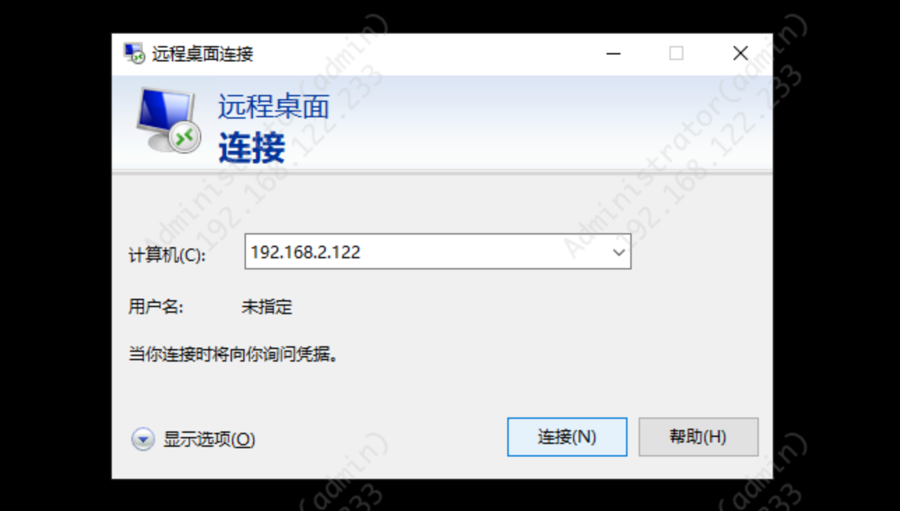
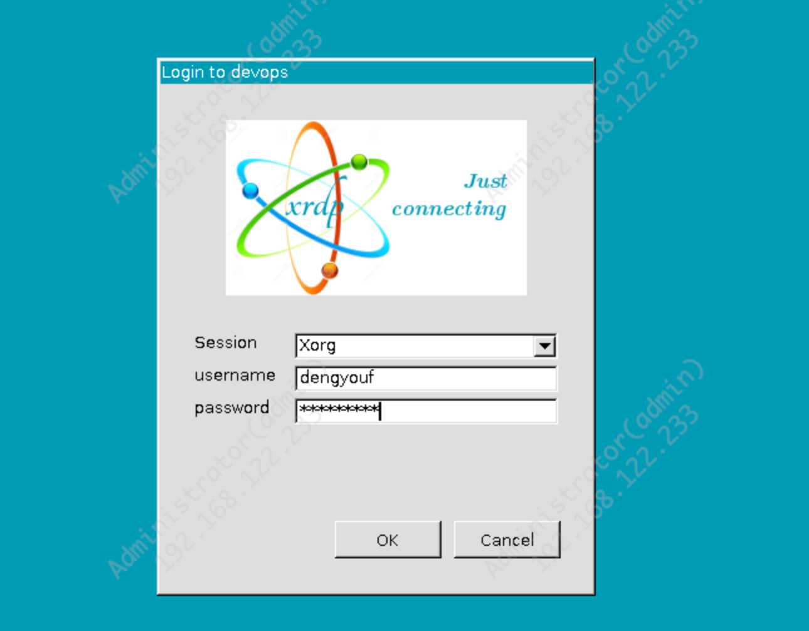
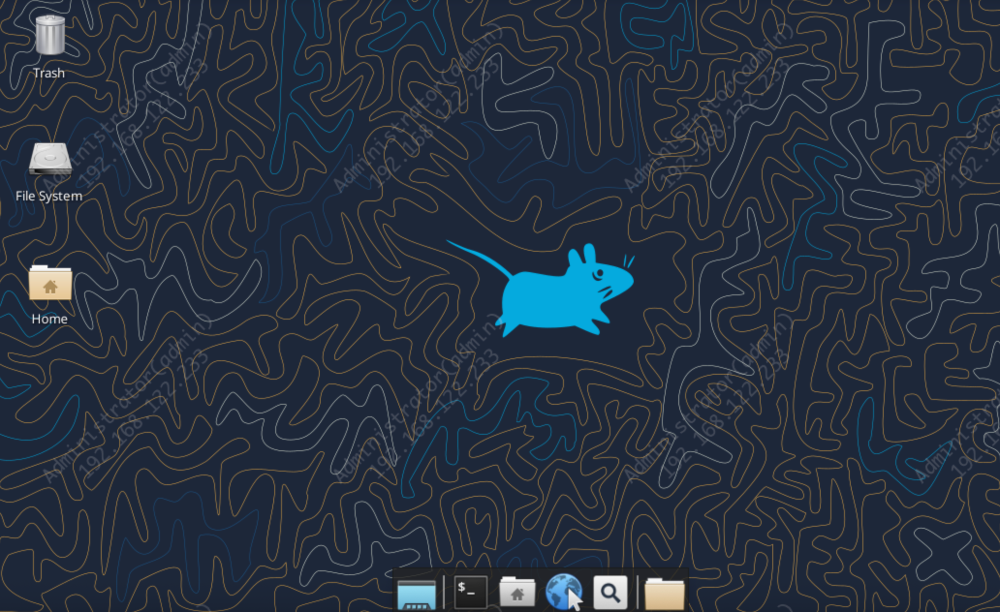

# Ubuntu 使用 XRDP 配置远程桌面（XFCE）完整教程

在 Ubuntu Server 上默认不包含桌面环境，如果我们希望通过 Windows 的远程桌面（RDP）访问 Ubuntu，就需要安装 XRDP，并配置一个轻量稳定的桌面环境（推荐 XFCE）。本文将从零开始，带你完成 XRDP + XFCE 的完整配置。

## 1. 安装 XRDP 与 XFCE 桌面环境

Ubuntu 默认仓库已经包含 XRDP 和 XFCE，直接安装即可：
```shell
sudo apt update
sudo apt install xfce4 xfce4-goodies xorgxrdp
```
- xfce4：轻量桌面环境
- xfce4-goodies：额外组件，提高体验
- xorgxrdp：XRDP 使用的 Xorg 后端（必装）

## 2. 为当前用户配置 XFCE 会话

XRDP 在登录时，会读取用户主目录下的 .xsession 文件，决定启动哪个桌面环境。

假设你的登录用户叫 dengyouf，执行：

```shell
sudo -u dengyouf bash -c 'echo xfce4-session > /home/dengyouf/.xsession'
sudo chown dengyouf:dengyouf /home/dengyouf/.xsession
```

## 3. 修复 Xauthority（避免黑屏问题）

XRDP 依赖 .Xauthority 存储 X11 会话认证，如果不存在可能导致黑屏立即断开。

```shell
sudo -u dengyouf touch /home/dengyouf/.Xauthority
sudo chown dengyouf:dengyouf /home/dengyouf/.Xauthority
```

```shell
virt-clone --auto-clone -o ubuntu24.04 -n devops-nexus3

sudo virt-sysprep  --operations defaults,machine-id,-ssh-userdir,-lvm-uuids --hostname devops-nexus3 --run-command "sed -i 's@192.168.122.253@192.168.122.131@g' /etc/netplan/50-cloud-init.yaml && dpkg-reconfigure openssh-server" -d devops-nexus3
```

## 4. 配置 XRDP 的 startwm.sh（关键步骤）

XRDP 默认会调用 /etc/xrdp/startwm.sh 启动桌面环境。
为了确保使用 XFCE，需要替换默认启动命令：
```shell
sudo bash -c 'cat > /etc/xrdp/startwm.sh' << EOF
#!/bin/sh
export XDG_SESSION_TYPE=x11
export DESKTOP_SESSION=xfce
startxfce4
EOF

sudo chmod +x /etc/xrdp/startwm.sh
```
这段脚本会强制 XRDP 启动 XFCE，避免默认 Xsession 导致无法启动桌面的问题。

## 5. 重启 XRDP 服务

使配置生效：

```shell
sudo systemctl restart xrdp
```
确保服务开机自启：

```shell
sudo systemctl enable xrdp
```

## 6. 防火墙放行 RDP（端口 3389）

如果你使用 ufw：
```shell
sudo ufw allow 3389/tcp
```


## 7. 使用 Windows 远程桌面连接

在 Windows 端打开：

- mstsc.exe


- 输入 Ubuntu 主机 IP 或域名
- 用户名：dengyouf
- 密码：用户自身登录密码


登录后即可看到 XFCE 桌面。


