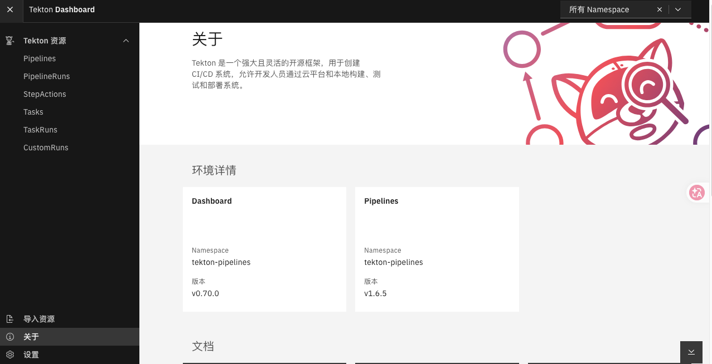

## Tekton

> [官网](https://tekton.dev/docs/)：`https://tekton.dev`

### 简介 

Tekton 是一套开源的用于构建CICD系统的云原生解决方案。其提供了灵活的易扩展的方式协助使用者构建CI/CD流水线。

Tekton 核心概念说明：

- [ ] Step：工作流的一个具体操作，每个Setp 都通过特定COntainer(Pod)运行
- [ ] Task: 由多个Step组成的序列，按照定义的顺序依次执行，运行在同一个Pod内切共享Pod环境变量和存储卷
- [ ] TaskRun: Task运行起来的具体实例，表现为执行Task的Pod
- [ ] Pipeline: 定义一个工作流程图，将多个Task串联起来完成一个工作流
- [ ] PipelineRun: Pipeline运行起来的具体实例，表示流水线的一次具体执行过程


### 部署

Teknton 系统[核心组件](https://tekton.dev/docs/concepts/overview/)介绍

- [ ] Tekton Pipelines: Tekton 的基础架构，定义一组Kubenretes CRD，作为CICD流水线的基本组件
- [ ] Tekton Dashboard: 基于 Web 的图形界面，用于管理 Tekton 管道
- [ ] Tekton Triggers: 根据事件来实例化流水线的执行
- [ ] Tekton CLI: 提供了一个基于 Kubernetes CLI 的命令行界面工具 tkn 与 Tekton 进行交互


#### [Tekton Pipelines](https://github.com/tektoncd/pipeline/releases#release-v1.6.5)

> [官网](https://tekton.dev/docs/installation/pipelines/)： https://tekton.dev/docs/installation/pipelines/

```bash
wget -O pipeline-v1.6.5.yaml https://infra.tekton.dev/tekton-releases/pipeline/previous/v1.6.5/release.yaml
kubectl apply -f pipeline-v1.6.5.yaml
kubectl  get pod -n tekton-pipelines
NAME                                           READY   STATUS    RESTARTS   AGE
tekton-events-controller-78d79dd956-bw548      1/1     Running   0          2m12s
tekton-pipelines-controller-74b7495766-hvrhm   1/1     Running   0          2m12s
tekton-pipelines-webhook-6b79b97b79-bdbt5      1/1     Running   0          2m11s
```

#### [Tekton Dashboard](https://github.com/tektoncd/dashboard/releases)

> [官网](https://tekton.dev/docs/dashboard/install/): https://tekton.dev/docs/dashboard/install/

```bash
wget -O dashboard-v0.70.0.yaml https://github.com/tektoncd/dashboard/releases/download/v0.70.0/release-full.yaml
kubectl apply -f dashboard-v0.70.0.yaml
kubectl  get pod -n tekton-pipelines
NAME                                           READY   STATUS    RESTARTS   AGE
tekton-dashboard-756d8f748c-7v6d9              1/1     Running   0          57s
kubectl patch svc tekton-dashboard -n tekton-pipelines -p '{"spec":{"type":"NodePort","ports":[{"port":9097,"targetPort":9097,"nodePort":30097}]}}'
kubectl  get svc -n tekton-pipelines
NAME                          TYPE        CLUSTER-IP      EXTERNAL-IP   PORT(S)                              AGE
tekton-dashboard              NodePort    10.108.171.21   <none>        9097:30097/TCP                       5m34s
```

!!! info "访问 Tekton Dashboard"
    通过`http://<任意节点IP>:30097`访问 Tekton Dashboard



#### [Tekton Triggers](https://github.com/tektoncd/triggers/releases#release-v0.36.0)

> [官网](https://tekton.cn/docs/triggers/install/): https://tekton.cn/docs/triggers/install/


```bash
wget -O trigger-v0.36.0.yaml  https://infra.tekton.dev/tekton-releases/triggers/previous/v0.36.0/release.yaml
kubectl apply -f trigger-v0.36.0.yaml
kubectl  get pod -n tekton-pipelines
NAME                                           READY   STATUS    RESTARTS   AGE
tekton-triggers-controller-5bf9988d79-2ltkz    1/1     Running   0          2m17s
tekton-triggers-webhook-85fc67c54f-4mfmn       1/1     Running   0          2m17s
```

#### [Tekton CLI](https://github.com/tektoncd/cli/releases)

```bash
wget https://github.com/tektoncd/cli/releases/download/v0.44.2/tkn_0.44.2_Linux_x86_64.tar.gz
tar -xf tkn_0.44.2_Linux_x86_64.tar.gz
mv tkn /usr/local/bin/
tkn version
Client version: 0.44.2
Pipeline version: v1.6.5
Triggers version: v0.36.0
Dashboard version: v0.70.0
```


### Tasks


???+ tip "实践前准备"

    - 创建Habor镜像凭据

    ```shell
    cat > harbor-secret.yaml <<EOF
    apiVersion: v1
    kind: Secret
    metadata:
      name: harbor-secret
      namespace: gitops
    type: kubernetes.io/dockerconfigjson
    data:
      .dockerconfigjson: ewoJImF1dGhzIjogewoJCSJoYXJib3IuZGV2b3BzLmlvIjogewoJCQkiYXV0aCI6ICJZV1J0YVc0NlNHRnlZbTl5TVRJek5EVT0iCgkJfQoJfQp9
    EOF
    
    kubectl apply -f harbor-secret.yaml
    ```
    
    - 创建GitLab访问凭据
    
    ```shell
    cat > gitlab-secret.yaml <<EOF
    apiVersion: v1
    kind: Secret
    metadata:
      name: gitlab-basic-auth
      namespace: gitops
      annotations:
        tekton.dev/git-0: http://gitlab.devops.io
    type: kubernetes.io/basic-auth
    stringData:
      username: "root"
      password: "dy6545286"
    EOF
    
    kubectl apply -f gitlab-secret.yaml
    ```

    - 关联ServiceAccount
    
    ```shell
    cat > tekton-ci-sa.yaml <<EOF
    ---
    apiVersion: v1
    kind: ServiceAccount
    metadata:
      name: tekton-ci-sa
      namespace: gitops
    secrets:
      - name: gitlab-basic-auth
    imagePullSecrets:
      - name: harbor-secret
    EOF
    
    kubectl apply -f tekton-ci-sa.yaml
    ```

#### Checkout


???+ info "**从 Git 仓库克隆源代码**"
    === "tasks/checkout.yaml"
            
        ```shell
        cat > checkout.yaml << 'EOF'
        apiVersion: tekton.dev/v1beta1
        kind: Task
        metadata:
          name: checkout
          namespace: gitops
        spec:
          params:
            - name: repoUrl
              type: string
              description: "Git 仓库地址"
            - name: repoBranch
              type: string
              default: "main"
              description: "Git 分支"
          workspaces:
            - name: source
              mountPath: /workspace
          steps:
            - name: git-clone
              image: harbor.devops.io/devops/git:v2.54.0
              workingDir: /workspace
              script: |
                #!/bin/sh
                set -e
                echo "仓库地址: $(params.repoUrl)"
                echo "分支: $(params.repoBranch)"
                repoName=$(basename "$(params.repoUrl)" .git)
                # 清理已存在的目录
                if [ -d "${repoName}" ]; then
                  rm -rf "${repoName}"
                fi
                # 克隆代码
                git clone -b "$(params.repoBranch)" "$(params.repoUrl)"
                # 查看克隆结果
                ls -la "${repoName}"
        EOF
        kubectl apply -f checkout.yaml
        ```
    === "pvc/shared-workspace.yaml"
        
        ```shell
        cat > shared-workspace.yaml << EOF
        ---
        apiVersion: v1
        kind: PersistentVolumeClaim
        metadata:
          name: shared-workspace-pvc
          namespace: gitops
        spec:
          accessModes:
            - ReadWriteOnce
          resources:
            requests:
              storage: 2Gi
          storageClassName: nfs-client
        EOF
        
        kubectl apply -f shared-workspace.yaml
        ```

    === "runs/checkout-run.yaml"
    
        ```
        cat > checkout-run.yaml << 'EOF'
        apiVersion: tekton.dev/v1beta1
        kind: TaskRun
        metadata:
          name: checkout-run
          namespace: gitops
        spec:
          serviceAccountName: tekton-ci-sa
          taskRef:
            name: checkout
          params:
            - name: repoUrl
              value: "http://gitlab.devops.io/devops/helloworld.git"
            - name: repoBranch
              value: "main"
          workspaces:
            - name: source
              persistentVolumeClaim:
                claimName: shared-workspace-pvc 
              # volumeClaimTemplate:
              #  spec:
              #    accessModes:
              #      - ReadWriteOnce
              #    resources:
              #      requests:
              #        storage: 100Mi
              #    storageClassName: nfs-client
          podTemplate:
            hostAliases:
              - ip: "172.16.143.251"
                hostnames:
                  - "gitlab.devops.io"
              - ip: "172.16.143.250"
                hostnames:
                  - "harbor.devops.io"
        EOF
        kubectl apply -f checkout-run.yaml
        ```

    === "运行和验证"
    
        ```shell
        # 运行 TaskRun
        kubectl apply -f runs/checkout-run.yaml
        
        # 查看 Pod 状态
        kubectl get pod -n gitops
        
        # 查看日志
        tkn taskrun logs -n gitops checkout-run
        ```

#### Build

???+ info "**编译构建 Java/Maven 项目**"

    === "pvc/maven-cache.yaml"
        
        ```shell
        cat > maven-cache.yaml << EOF
        apiVersion: v1
        kind: PersistentVolumeClaim
        metadata:
          name: maven-cache-pvc
          namespace: gitops
        spec:
          accessModes:
            - ReadWriteOnce
          resources:
            requests:
              storage: 50Gi
          storageClassName: nfs-client
        EOF
        kubectl apply -f maven-cache.yaml
        ```

    === "tasks/build.yaml"
    
        ```shell
        cat > build.yaml << 'EOF'
        apiVersion: tekton.dev/v1
        kind: Task
        metadata:
          name: build
          namespace: gitops
        spec:
          params:
            - name: buildCmd
              type: string
              description: "Maven 构建命令"
              default: "mvn clean package -DskipTests"
            - name: repoName
              type: string
              description: "代码仓库名称"
          workspaces:
            - name: source
              mountPath: /workspace
          steps:
            - name: build-package
              image: harbor.devops.io/devops/maven:3.9.16-eclipse-temurin-17-noble
              workingDir: /workspace
              env:
                - name: MAVEN_OPTS
                  value: "-Dmaven.repo.local=/root/.m2/repository"
              volumeMounts:
                - name: m2-cache
                  mountPath: /root/.m2
              script: |
                #!/bin/sh
                set -e
                
                echo "开始构建..."
                cd "$(params.repoName)"
                $(params.buildCmd)
                
                echo "构建完成！"
          volumes:
            - name: m2-cache
              persistentVolumeClaim:
                claimName: maven-cache-pvc
        EOF
        kubectl apply -f build.yaml
        ```

    === "runs/build-run.yaml"
        
        ```shell
        cat > build-run.yaml << 'EOF'
        apiVersion: tekton.dev/v1beta1
        kind: TaskRun
        metadata:
          name: build-run
          namespace: gitops
        spec:
          serviceAccountName: tekton-ci-sa
          taskRef:
            name: build
          params:
            - name: buildCmd
              value: "mvn clean package -DskipTests -U -s settings.xml"
            - name: repoName
              value: "helloworld"
          workspaces:
            - name: source
              persistentVolumeClaim:
                claimName: shared-workspace-pvc
        EOF
        kubectl apply -f build-run.yaml
        ```

#### Image

???+ info "**使用 Buildah 构建容器镜像并推送到 Harbor**"

    === "tasks/image.yaml"
        
        ```shell
        cat > image.yaml << 'EOF'
        apiVersion: tekton.dev/v1
        kind: Task
        metadata:
          name: image
          namespace: gitops
        spec:
          params:
            - name: harborUrl
              type: string
              description: "Harbor 仓库地址"
            - name: imagePath
              type: string
              description: "镜像路径 (项目/仓库名)"
            - name: repoName
              type: string
              description: "代码仓库名称"
          workspaces:
            - name: source
              mountPath: /workspace
          results:
            - name: imageFullName
              description: "完整的镜像名称"
          steps:
            - name: buildah-image
              image: harbor.devops.io/devops/buildah:stable
              workingDir: /workspace
              securityContext:
                privileged: true
                capabilities:
                  add:
                    - SYS_ADMIN
              env:
                - name: TZ
                  value: "Asia/Shanghai"
                - name: BUILD_REGISTRY_SOURCES
                  value: '{"insecureRegistries": ["harbor.devops.io"]}'
              script: |
                #!/bin/sh
                set -e
                
                # 生成镜像标签
                datetime="$(date '+%Y%m%d%H%M%S')"
                imageTag="v${datetime}"
                imageFullName="$(params.harborUrl)/$(params.imagePath):${imageTag}"
                
                # 输出镜像名称供后续 Task 使用
                echo -n "${imageFullName}" | tee "$(results.imageFullName.path)"
                
                # 进入代码目录
                cd "$(params.repoName)"
                
                # 登录 Harbor
                export BUILDAH_REGISTRY_TLS_VERIFY=0
                echo "Harbor12345" | buildah login \
                  --tls-verify=false \
                  -u admin \
                  --password-stdin harbor.devops.io
                
                # 构建镜像
                echo "构建镜像: ${imageFullName}"
                buildah --tls-verify=false bud -t "${imageFullName}" .
                
                # 推送镜像
                echo "推送镜像: ${imageFullName}"
                buildah push --tls-verify=false "${imageFullName}"
                
                echo "✅ 镜像推送成功: ${imageFullName}"
        EOF
        kubectl apply -f image.yaml
        ```

    === "runs/image-run.yaml"

        ```shell
        cat > image-run.yaml << 'EOF'
        apiVersion: tekton.dev/v1
        kind: TaskRun
        metadata:
          name: image-run
          namespace: gitops
        spec:
          serviceAccountName: tekton-ci-sa
          taskRef:
            name: image
          params:
            - name: harborUrl
              value: "harbor.devops.io"
            - name: imagePath
              value: "newproj/helloworld"
            - name: repoName
              value: "helloworld"
          workspaces:
            - name: source
              persistentVolumeClaim:
                claimName: shared-workspace-pvc
          podTemplate:
            hostAliases:
              - ip: "172.16.143.250"
                hostnames:
                  - "harbor.devops.io"
        EOF
        kubectl apply -f image-run.yaml
        ```


#### Deploy

???+ info "更新 Kubernetes 资源并部署应用到指定的namespace"


    === "rbac/tekton-cd-sa.yaml"
        
        ```shell
        cat > tekton-cd-sa.yaml << 'EOF'
        apiVersion: rbac.authorization.k8s.io/v1
        kind: ClusterRoleBinding
        metadata:
          name: tekton-cd-sa
        roleRef:
          apiGroup: rbac.authorization.k8s.io
          kind: ClusterRole
          name: cluster-admin
        subjects:
          - kind: ServiceAccount
            name: tekton-cd-sa
            namespace: gitops
        ---
        apiVersion: v1
        kind: ServiceAccount
        metadata:
          name: tekton-cd-sa
          namespace: gitops
        imagePullSecrets:
          - name: harbor-secret
        EOF
        
        kubectl apply -f tekton-cd-sa.yaml
        ```

    === "tasks/deploy.yaml"

        ```shell
        cat > deploy.yaml << 'EOF'
        apiVersion: tekton.dev/v1
        kind: Task
        metadata:
          name: deploy
          namespace: gitops
        spec:
          params:
            - name: imageFullName
              type: string
              description: "完整的镜像名称"
            - name: repoName
              type: string
              description: "代码仓库名称"
            - name: namespace
              type: string
              default: "test"
              description: "部署的 Kubernetes 命名空间"
          workspaces:
            - name: source
              mountPath: /workspace
          steps:
            - name: update-manifests
              image: harbor.devops.io/devops/alpine:latest
              workingDir: /workspace
              script: |
                #!/bin/sh
                set -e
                
                cd "$(params.repoName)"
                
                echo "更新 Deployment 镜像..."
                sed -i -e \
                  "s@__IMAGE__@$(params.imageFullName)@g" \
                  manifests/deployment.yaml
                
                echo "更新后的 Deployment:"
                cat manifests/deployment.yaml
            
            - name: deploy-to-cluster
              image: harbor.devops.io/devops/kubectl:v1.25
              workingDir: /workspace
              script: |
                #!/bin/sh
                set -e
                
                cd "$(params.repoName)"
                
                echo "部署应用到命名空间: $(params.namespace)"
                kubectl apply -f manifests/deployment.yaml -n "$(params.namespace)"
                
                echo "等待 Pod 就绪..."
                kubectl rollout status deployment/helloworld \
                  -n "$(params.namespace)" \
                  --timeout=120s
                
                echo "✅ 部署成功！"
        EOF
        kubectl apply -f deploy.yaml
        ```

    === "runs/deploy-run.yaml"

        ```shell
        cat > deploy-run.yaml << 'EOF'
        apiVersion: tekton.dev/v1
        kind: TaskRun
        metadata:
          name: deploy-run
          namespace: gitops
        spec:
          serviceAccountName: tekton-cd-sa
          taskRef:
            name: deploy
          retries: 3
          params:
            - name: imageFullName
              value: "harbor.devops.io/newproj/helloworld:v20260724094034"
            - name: repoName
              value: "helloworld"
            - name: namespace
              value: "test"
          workspaces:
            - name: source
              persistentVolumeClaim:
                claimName: checkout-pvc
          podTemplate:
            hostAliases:
              - ip: "172.16.143.250"
                hostnames:
                  - "harbor.devops.io"
        EOF
        kubectl apply -f deploy-run.yaml
        ```


### Pipeline

???+ info "使用流水线完整串联整个流程"

=== "pipelines/ci-cd-pipeline.yaml"

```shell
cat > ci-cd-pipeline.yaml << 'EOF'
# pipelines/ci-cd-pipeline.yaml
---
apiVersion: tekton.dev/v1
kind: Pipeline
metadata:
  name: ci-cd-pipeline
  namespace: gitops
  labels:
    app: helloworld
spec:
  params:
    # Git 参数
    - name: repoUrl
      type: string
      description: "Git 仓库地址"
    - name: repoBranch
      type: string
      default: "main"
      description: "Git 分支"
    - name: repoName
      type: string
      description: "代码仓库名称"
    
    # Harbor 参数
    - name: harborUrl
      type: string
      default: "harbor.devops.io"
    - name: harborProject
      type: string
      default: "newproj"
    
    # 构建参数
    - name: buildCmd
      type: string
      default: "mvn clean package -DskipTests -U"
    
    # 部署参数
    - name: deployNamespace
      type: string
      default: "test"
  
  workspaces:
    - name: workspace
      description: "共享工作空间"
    - name: maven-cache
      description: "Maven 缓存"
      optional: true

  tasks:
    # 1. 拉取代码
    - name: checkout
      taskRef:
        name: checkout
      params:
        - name: repoUrl
          value: "$(params.repoUrl)"
        - name: repoBranch
          value: "$(params.repoBranch)"
      workspaces:
        - name: source
          workspace: workspace
    
    # 2. 构建编译
    - name: build
      taskRef:
        name: build
      runAfter:
        - checkout
      params:
        - name: buildCmd
          value: "$(params.buildCmd)"
        - name: repoName
          value: "$(params.repoName)"
      workspaces:
        - name: source
          workspace: workspace
        - name: m2-cache
          workspace: maven-cache
    
    # 3. 构建镜像
    - name: build-image
      taskRef:
        name: image
      runAfter:
        - build
      params:
        - name: harborUrl
          value: "$(params.harborUrl)"
        - name: imagePath
          value: "$(params.harborProject)/$(params.repoName)"
        - name: repoName
          value: "$(params.repoName)"
      workspaces:
        - name: source
          workspace: workspace
    
    # 4. 部署应用
    - name: deploy
      taskRef:
        name: deploy
      runAfter:
        - build-image
      params:
        - name: imageFullName
          value: "$(tasks.build-image.results.imageFullName)"
        - name: repoName
          value: "$(params.repoName)"
        - name: namespace
          value: "$(params.deployNamespace)"
      workspaces:
        - name: source
          workspace: workspace
EOF
kubectl apply -f  ci-cd-pipeline.yaml
```
